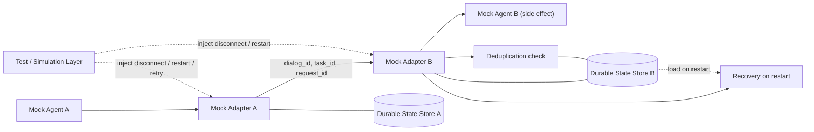
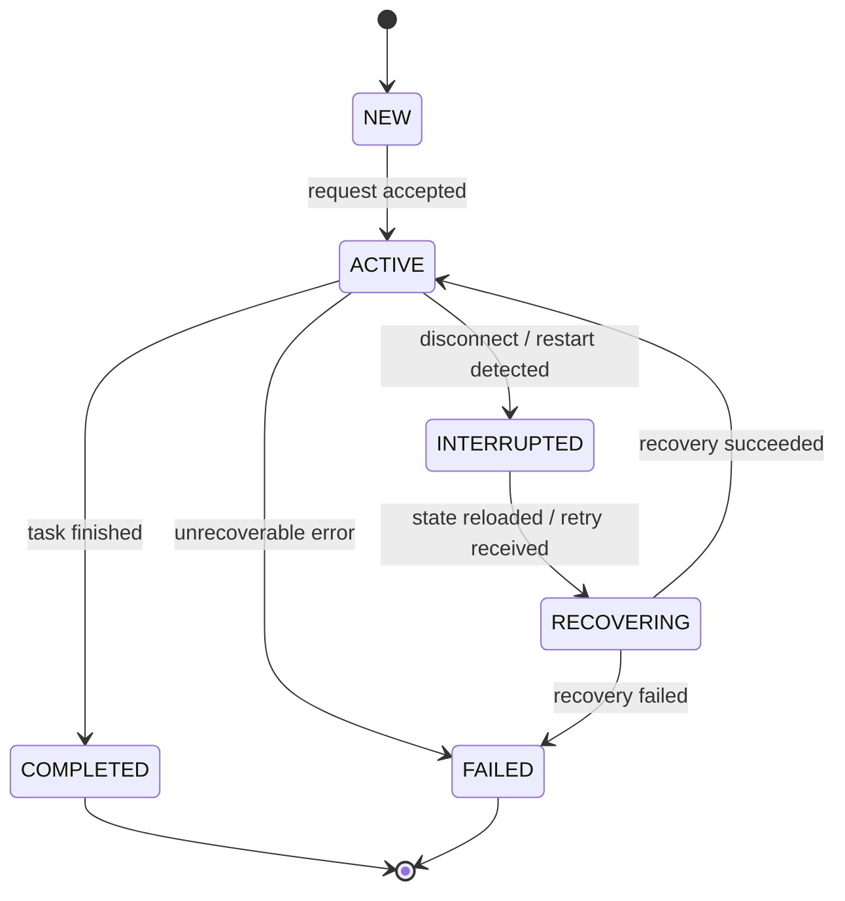
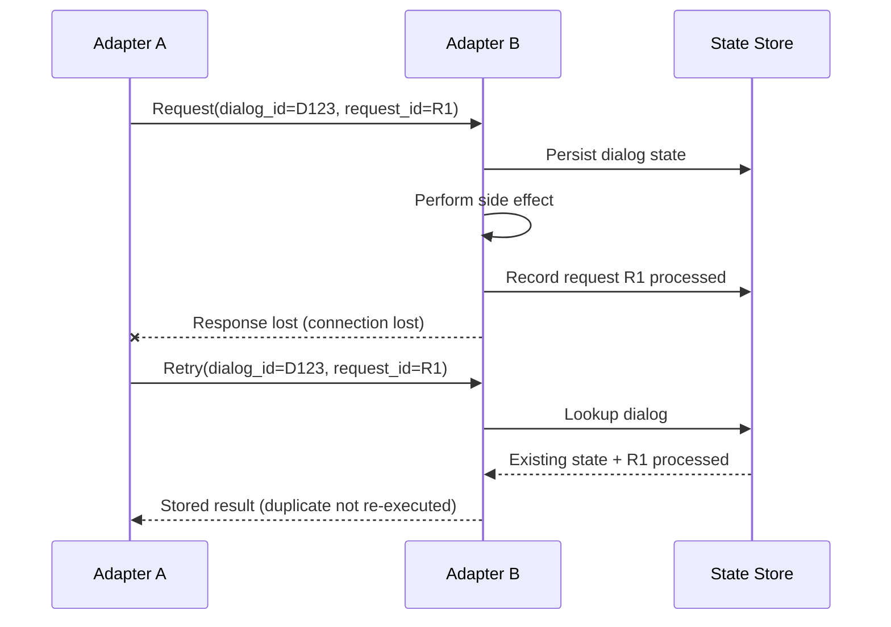
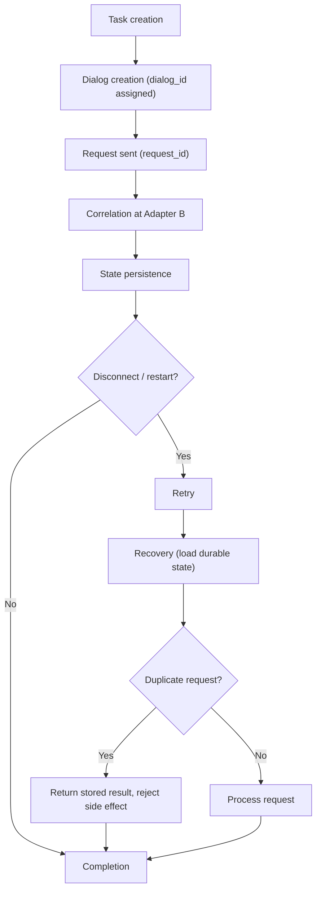

# Nighthawks: Dialog Correlation and Recovery Prototype

**PS-021: Experimental Dialog Correlation and Recovery Across Agent Adapters**
**Team: Nighthawks** | AIORI-3 | Category: 6G & Future Networks

> A prototype that connects two mock agent adapters and shows how explicit dialog IDs, lifecycle states, request deduplication, and durable state let a task survive a disconnect or restart without losing its identity or repeating side effects.

> **Status note.** This README is written against the official PS-021 Problem Statement. Sections labelled **Requirement** come from that document. Anything labelled **Proposed** is a Nighthawks design choice. Anything labelled **TBD** has not been decided or measured yet. No implementation details, test results, or repository files are claimed beyond what is stated here. Update the TBD items as the prototype is built.

---

## Table of Contents

1. [Project Overview](#1-project-overview)
2. [Problem Statement](#2-problem-statement)
3. [Why This Problem Matters](#3-why-this-problem-matters)
4. [Key Concepts](#4-key-concepts)
5. [Core Idea of the Solution](#5-core-idea-of-the-solution)
6. [Architecture](#6-architecture)
7. [Component Description](#7-component-description)
8. [Dialog-State Schema](#8-dialog-state-schema)
9. [Lifecycle State Machine](#9-lifecycle-state-machine)
10. [Dialog Correlation](#10-dialog-correlation)
11. [Request Deduplication](#11-request-deduplication)
12. [Durable State and Recovery](#12-durable-state-and-recovery)
13. [Disconnect and Retry Handling](#13-disconnect-and-retry-handling)
14. [Five Disconnect/Retry Test Scenarios](#14-five-disconnectretry-test-scenarios)
15. [Failure and Recovery Matrix](#15-failure-and-recovery-matrix)
16. [End-to-End Workflow](#16-end-to-end-workflow)
17. [Detailed Execution Flow](#17-detailed-execution-flow)
18. [Data Flow](#18-data-flow)
19. [API / Message Format](#19-api--message-format)
20. [Pseudocode](#20-pseudocode)
21. [Technology Stack](#21-technology-stack)
22. [Project Structure](#22-project-structure)
23. [Installation](#23-installation)
24. [Running the Prototype](#24-running-the-prototype)
25. [Running Tests](#25-running-tests)
26. [Demonstration Guide](#26-demonstration-guide)
27. [Expected Demonstration Output](#27-expected-demonstration-output)
28. [Results](#28-results)
29. [Requirements Traceability](#29-requirements-traceability)
30. [Relationship to IETF Agentproto](#30-relationship-to-ietf-agentproto)
31. [MCP and A2A Context](#31-mcp-and-a2a-context)
32. [Design Decisions](#32-design-decisions)
33. [Limitations](#33-limitations)
34. [Future Enhancements](#34-future-enhancements)
35. [Security Considerations](#35-security-considerations)
36. [Observability and Debugging](#36-observability-and-debugging)
37. [Troubleshooting](#37-troubleshooting)
38. [Glossary](#38-glossary)
39. [References](#39-references)
40. [Team](#40-team)
41. [License](#41-license)
42. [Hackathon Deliverables Checklist](#42-hackathon-deliverables-checklist)

---

## 1. Project Overview

### What problem are we solving?

AI agents increasingly work together, passing tasks to one another across different frameworks. These frameworks each keep track of "which conversation is this?" in their own way. When something goes wrong mid-task, such as a network drop or an agent restart, there is often no shared, explicit record of which task a message belongs to or whether it was already handled.

### Why does this problem exist?

There is no single standardized way for agents to track a dialog. Each framework manages conversation context in its own, often proprietary, way. The IETF has an agent-protocol discussion group exploring this space, but nothing there is final.

### What happens when a task is interrupted?

Consider Agent A sending a task to Agent B through adapters, and the connection dropping:

- A does not know whether B received the request.
- If B restarted, B may have forgotten the task entirely.
- A retries, since retrying is the natural reaction to silence.

### Why can context and task identity be lost?

If the dialog and task identity live only in memory, a restart erases them. A retry then arrives with nothing to match it to, and it looks like a brand-new task.

### Why can retries cause duplicate operations?

A retry is indistinguishable from a new request unless the receiver can recognize it. If the original request had already been processed (only the acknowledgement was lost), processing the retry performs the side effect a second time. Examples are sending a message twice, creating two records, or charging twice.

### What does our prototype demonstrate?

It demonstrates, using two mock agent adapters:

- Tasks correlated by an explicit **dialog ID**.
- Explicit **lifecycle states** with valid transitions.
- **Request deduplication** so a retry does not repeat a side effect.
- **Durable state** so task identity survives an adapter restart.
- Behavior across **five simulated disconnect/retry scenarios**.

---

## 2. Problem Statement

**PS-021: Experimental Dialog Correlation and Recovery Across Agent Adapters** (AIORI-3, Category: 6G & Future Networks).

**Challenge (from the Problem Statement):** Build a prototype that correlates tasks across two mock agent adapters using dialog IDs, explicit lifecycle states, request deduplication, and durable recovery after a restart.

### Requirements (official)

| # | Requirement from PS-021 |
|---|---|
| R1 | Implement 2 mock agent adapters. |
| R2 | Use 1 defined dialog-state schema. |
| R3 | Preserve task identity across adapter restarts. |
| R4 | Implement request deduplication to prevent duplicate side effects. |
| R5 | Test 5 disconnect/retry scenarios. |
| R6 | Define explicit lifecycle states and valid state transitions. |
| R7 | Use a mentor-selected, pinned draft or clearly labelled experimental schema. |
| R8 | No claim of final IETF-standard implementation, complete MCP/A2A interoperability, or universal exactly-once delivery. |

### Expected outcomes (official)

- Two working mock adapter implementations
- Dialog-state schema and state machine
- Durable state/recovery mechanism
- Request deduplication mechanism
- Five disconnect/retry test scenarios
- Interoperability and recovery test results
- Demonstration showing task identity preservation and duplicate-side-effect rejection

### Deliverables (official)

1. **GitHub collaboration:** private repository, `aiori-hackathon` added as collaborator, ownership transferred after the request is accepted, repository named after the team.
2. A **PDF uploaded to the repository** following the organizers' *Proposed-structure-hackathon.pdf*.
3. **Prototype demonstration with a pseudocode snippet** shown to the mentor.

### What the Problem Statement does *not* specify

The Problem Statement does **not** prescribe the following. All of it is a Nighthawks design choice in this README:

- The exact fields of the dialog-state schema (it asks for "1 defined schema", not a specific one)
- The specific lifecycle states and transitions
- The definitions of the five scenarios
- The programming language, storage mechanism, or transport
- The deduplication algorithm

> **Open item:** R7 refers to a "mentor-selected, pinned draft or clearly labelled experimental schema". If the mentor selects a schema, this README must be updated to reference it. Until then, our schema is a **clearly labelled experimental schema**.

---

## 3. Why This Problem Matters

```text
Agent A
   |
   | Task
   v
Adapter B
   |
   X  Network disconnect
   |
   v
Retry
```

What can go wrong:

| Risk | What happens |
|---|---|
| Lost task context | After a restart, Adapter B has no memory of the task. |
| Unknown task identity | The retry carries no identifier B recognizes, so it looks like a new task. |
| Duplicate request processing | B processes the same logical request twice. |
| Duplicate side effects | The real-world effect (a write, a message, a payment) happens twice. |
| Failure to continue an existing task | The task restarts from scratch instead of resuming. |

PS-021 asks for a prototype in which these failures are prevented using explicit identifiers, explicit states, and persisted records.

---

## 4. Key Concepts

> Definitions below are written for this project. Where a term is used in a general way in the wider industry, we only explain its meaning in PS-021.

### Agent
- **Definition:** A software entity (often AI-driven) that performs tasks and may communicate with other agents.
- **In PS-021:** Both ends of the exchange are *mock* agents, simple stand-ins for real agents.

### Agent Adapter
- **Definition:** A component that translates between an agent and the communication channel, and manages exchange details for it.
- **In PS-021:** The two mock adapters are the main deliverable. They carry dialog identity, track state, and handle retries and restarts.

### Dialog
- **Definition:** A bounded exchange between two parties about a piece of work.
- **In PS-021:** The unit that gets an explicit ID and a lifecycle.

### Dialog ID
- **Definition:** A unique identifier for one dialog.
- **In PS-021:** The primary correlation key.
- **Example:** `dialog_id = D123`

### Dialog Context
- **Definition:** The minimum information needed to recognize and continue a dialog.
- **In PS-021 (Proposed):** Identifiers and lifecycle state only. It is *not* chat history or model memory (see [Section 8](#8-dialog-state-schema)).

### Dialog State
- **Definition:** The recorded current status of a dialog (identity plus lifecycle state, plus bookkeeping).
- **In PS-021:** The object defined by our schema and persisted for recovery.

### Task
- **Definition:** The unit of work one agent asks another to perform.
- **In PS-021:** Its identity (`task_id`) must be preserved across restarts.

### Correlation
- **Definition:** Matching an incoming message to the existing dialog/task it belongs to.
- **In PS-021:** How Adapter B knows a retry belongs to an existing task.

### Lifecycle State
- **Definition:** A named stage in a dialog's life, for example active or completed.
- **In PS-021:** Explicitly required (R6).

### State Transition
- **Definition:** A move from one lifecycle state to another.
- **In PS-021:** Only *valid* transitions are allowed (R6). Others are rejected.

### Retry
- **Definition:** Sending a request again because the outcome of the first attempt is unknown.
- **In PS-021:** The trigger for both correlation and deduplication.

### Disconnect
- **Definition:** Loss of the communication link between the two sides.
- **In PS-021:** Simulated in five scenarios.

### Recovery
- **Definition:** Restoring a dialog to a usable state after a failure.
- **In PS-021:** Loading persisted state after an adapter restart.

### Durable State
- **Definition:** State stored so that it survives a process restart.
- **In PS-021:** Required to preserve task identity (R3).

### Request Deduplication
- **Definition:** Recognizing that a request was already received or processed and not acting on it again.
- **In PS-021:** Required to prevent duplicate side effects (R4).

### Duplicate Side Effect
- **Definition:** A real effect of processing (a write, an action) that happens more than once for one logical request.
- **In PS-021:** What deduplication exists to prevent.

### Experimental Schema
- **Definition:** A schema that is a working proposal, not a ratified standard.
- **In PS-021:** Our dialog-state schema is experimental and inspired by emerging IETF agent-protocol discussions. It is not a finalized standard.

---

## 5. Core Idea of the Solution

> Conceptual flow. The actual implementation may differ and this section will be updated to match it.

```text
Task starts
    ↓
Dialog ID assigned
    ↓
Request sent through Adapter A
    ↓
Adapter B correlates request
    ↓
Dialog state is persisted
    ↓
Disconnect / restart occurs
    ↓
Request is retried
    ↓
Existing dialog is identified
    ↓
Durable state is recovered
    ↓
Duplicate request is detected if necessary
    ↓
Task continues safely
```

The idea rests on three simple rules:

1. **Name everything explicitly.** A dialog and a task get IDs, and each request gets an identity.
2. **Write it down before relying on it.** State is persisted, so a restart does not erase it.
3. **Check before acting.** Before processing, look up whether this request was already handled.

---

## 6. Architecture

> **Proposed architecture.** The Problem Statement requires two mock adapters but does not prescribe how they are structured.



Notes:

- Whether each adapter has its own store or both share one is **TBD** (see [Section 32](#32-design-decisions)).
- "Durable State Store" is a role, not a chosen technology. See [Section 21](#21-technology-stack).
- The transport between adapters (in-process, local sockets, HTTP, etc.) is **TBD**.

---

## 7. Component Description

> Component names are **proposed**. Update them to the real names once the code exists.

### Mock Agent Adapter A (initiator side)
Creates the dialog and assigns IDs, sends requests, and retries when it does not get a response. It persists its own view of the dialog so it can reuse the same `dialog_id`/`task_id` after its own restart.

### Mock Agent Adapter B (receiver side)
Receives requests and correlates them to dialogs. It consults the deduplication mechanism, applies the side effect at most once per request identity, persists state, and returns a response.

### Dialog State Manager
Owns the dialog-state record. It creates, looks up, and updates dialogs, and enforces valid lifecycle transitions.

### Durable State Store
Persists dialog state and request records so they survive adapter restarts. The storage technology is **TBD**.

### Deduplication Mechanism
Records which request identities have been processed, along with the outcome. It lets a retry return the recorded outcome instead of repeating the side effect.

### Recovery Mechanism
On adapter startup, loads persisted dialogs and request records, and restores the ability to correlate incoming retries.

### Mock Agent / Side-Effect Target
A simple stand-in that performs an observable action (for example, appending to a log or incrementing a counter). Counting how many times it ran is how we *demonstrate* that duplicates are rejected.

### Test / Simulation Layer
Injects the disconnects, restarts, and retries that define the five scenarios, and asserts expected outcomes.

---

## 8. Dialog-State Schema

> **Proposed example. Experimental and not a finalized standard.** Per R2 and R7, the project must use one defined schema, either mentor-selected and pinned or clearly labelled experimental. If a mentor selects a schema, replace this section with it.

```json
{
  "schema_version": "0.1-experimental",
  "dialog_id": "D123",
  "task_id": "T456",
  "state": "ACTIVE",
  "initiator": "adapter-a",
  "responder": "adapter-b",
  "last_request_id": "R789",
  "created_at": "<timestamp>",
  "updated_at": "<timestamp>"
}
```

| Field | Purpose | Status |
|---|---|---|
| `schema_version` | Marks the schema as experimental and versioned. | Proposed |
| `dialog_id` | Unique identity of the dialog. Primary correlation key. | Proposed |
| `task_id` | Identity of the task being performed. Preserved across restarts. | Proposed |
| `state` | Current lifecycle state (see [Section 9](#9-lifecycle-state-machine)). | Proposed |
| `initiator` / `responder` | Which adapters are the parties. | Proposed |
| `last_request_id` | The latest request seen, useful for diagnostics. | Proposed |
| `created_at` / `updated_at` | Timestamps for debugging. | Proposed |

Whether `dialog_id` and `task_id` are separate or one identifier is a design choice (see [Section 32](#32-design-decisions)).

### Why each element exists

- **Why a dialog ID exists:** So both sides name the same exchange explicitly instead of inferring it from connection or session.
- **Why task identity matters:** After a restart, the system must resume the *same* task, not create a new one.
- **Why lifecycle state matters:** It tells the adapter what is allowed next (for example, a completed task must not be re-executed).

### Information needed for correlation (Proposed)
`dialog_id`, and `task_id` as a consistency check.

### Information needed for recovery (Proposed)
`dialog_id`, `task_id`, `state`, and the record of processed request identities and their outcomes.

### Deliberately NOT part of dialog context (Proposed)

- Conversation history or message transcripts
- AI model memory or prompts
- Agent reasoning or internal state

> Dialog state is a small coordination record. It is not a conversation log and not model memory.

---

## 9. Lifecycle State Machine

> **Proposed design.** The Problem Statement requires explicit states and valid transitions (R6) but does not define them.



### States

| State | Meaning (Proposed) |
|---|---|
| `NEW` | Dialog created, no request accepted yet. |
| `ACTIVE` | Task in progress. |
| `INTERRUPTED` | A disconnect or restart interrupted the dialog. |
| `RECOVERING` | State is being restored and reconciled with a retry. |
| `COMPLETED` | Task finished. Terminal. |
| `FAILED` | Task failed unrecoverably. Terminal. |

### Valid transitions
Exactly those drawn in the diagram.

### Invalid transitions (examples)

- `COMPLETED → ACTIVE` (a finished task must not be reopened)
- `FAILED → ACTIVE` (without a defined retry policy)
- `NEW → COMPLETED` (cannot complete work that never started)

Invalid transitions are rejected and logged (see [Section 36](#36-observability-and-debugging)).

### Why explicit lifecycle management is required
Without explicit states, an adapter cannot answer "what do I do with this retry?". For example, a retry on a `COMPLETED` dialog must return the recorded result, while a retry on an `INTERRUPTED` dialog should resume.

---

## 10. Dialog Correlation

> **Question:** How does Adapter B know that an incoming request belongs to an existing task/dialog?

**Answer (Proposed):** Every request carries explicit identifiers. B looks up the dialog by `dialog_id` in its durable state, and cross-checks `task_id`.

| Identifier | Role (Proposed) |
|---|---|
| `dialog_id` | Which dialog this request belongs to. |
| `task_id` | Which task within the dialog. Consistency check. |
| `request_id` | Which specific request this is. Used for deduplication. |

```text
Request 1
dialog_id  = D123
task_id    = T456
request_id = R789

Retry Request
dialog_id  = D123
task_id    = T456
request_id = R789      <- same request identity
```

Because the retry carries the same `dialog_id` and `task_id`, B finds the existing record, even after a restart (the record was reloaded from durable storage), and associates the retry with the existing dialog instead of creating a new one.

If `dialog_id` is found but `task_id` does not match, the request is rejected as inconsistent. If `dialog_id` is unknown, B treats it as a new dialog (or rejects it). The exact policy is **TBD**.

---

## 11. Request Deduplication

- **Duplicate request:** A request whose `request_id` (within a dialog) has already been received.
- **Why retries create duplicates:** The sender cannot tell "request lost" from "response lost", so it resends.
- **Why duplicate processing is dangerous:** The side effect runs twice.
- **How the prototype detects duplicates (Proposed):** B persists a record keyed by `(dialog_id, request_id)` containing the processing status and the result. Before processing, B checks it.
- **How duplicate side effects are rejected (Proposed):** If a record shows the request was already processed, B returns the stored result (or a duplicate marker) and does *not* re-run the side effect.

```text
receive request
       ↓
check request identity (dialog_id, request_id)
       ↓
already processed?
   /          \
 yes           no
 ↓              ↓
return stored   process side effect
result / reject      ↓
                persist result
                     ↓
                  respond
```

### The ordering problem

The crash window between "perform side effect" and "persist record" matters. If B performs the side effect and crashes before recording it, a retry could repeat it. How we handle this (for example, recording intent before acting, or making the side effect itself idempotent in the mock) is **TBD** and is an explicit [limitation](#33-limitations). We do **not** claim universal exactly-once delivery.

---

## 12. Durable State and Recovery

### Runtime state
Temporary state held in memory while an adapter is running. It is lost on restart.

### Durable state
State persisted to storage so it can survive a restart. Required for R3.

### Recovery flow

```text
Adapter running
     ↓
Dialog state persisted
     ↓
Adapter crashes / restarts
     ↓
State loaded from durable storage
     ↓
Dialog becomes available again
     ↓
Retry can be correlated
```

What is persisted (Proposed): dialog-state records and request-deduplication records.
Storage mechanism: **TBD**.

---

## 13. Disconnect and Retry Handling

| Term | Meaning here |
|---|---|
| **Disconnect** | The link drops. The sender does not know what the receiver saw. |
| **Retry** | The sender resends the request. |
| **Correlation** | The receiver matches the retry to an existing dialog. |
| **Recovery** | The receiver (or sender) restores state after a restart. |
| **Deduplication** | The receiver avoids repeating the side effect. |



> Proposed flow. Adapt it to the final implementation.

---

## 14. Five Disconnect/Retry Test Scenarios

> **Proposed Test Scenarios.** PS-021 requires *five* scenarios (R5) but does not define them. These are Nighthawks proposals. Results are not yet available (see [Section 28](#28-results)).

| # | Name | Initial condition | Action | Failure / disconnect | Retry | Expected correlation | Expected recovery | Expected deduplication | Final result |
|---|---|---|---|---|---|---|---|---|---|
| 1 | Request lost in transit | Dialog `NEW` | A sends request | Link drops before B receives it | A resends | B sees dialog for the first time (or creates it) | None needed | Not a duplicate. Processed once. | Side effect applied once, task `ACTIVE` |
| 2 | Response lost after processing | Dialog `ACTIVE` | A sends request, B processes | Link drops before the response reaches A | A resends same `request_id` | Found by `dialog_id` | State read from store | Duplicate detected. Side effect not repeated. | Side effect applied once, stored result returned |
| 3 | Receiver (B) restarts mid-task | Dialog `ACTIVE`, state persisted | B processes part of the task | B process restarts | A retries | B reloads dialog and correlates | State loaded from durable store | Previously processed requests recognized | Same `task_id` continues, no duplicate |
| 4 | Sender (A) restarts mid-task | Dialog `ACTIVE`, A has persisted its record | A sends request | A restarts before seeing the response | A resumes and resends using persisted IDs | Same `dialog_id`/`task_id` reused | A reloads its dialog record | Duplicate detected at B | Task identity preserved, side effect once |
| 5 | Retry after completion | Dialog `COMPLETED` | Task finishes | Response lost | A retries the original request | Found by `dialog_id`, state is terminal | Terminal state read from store | Duplicate rejected, no re-execution, no illegal transition | Stored final result returned, state stays `COMPLETED` |

---

## 15. Failure and Recovery Matrix

> Based on the **proposed** design. Fill in against the real implementation.

| Failure | What is lost? | What remains? | Recovery action | Expected result |
|---|---|---|---|---|
| Network disconnect | In-flight message or response | Persisted dialog state on both sides | Sender retries with same IDs | Retry correlated, duplicate checked |
| Adapter B restart | B's in-memory state | B's durable dialog and request records | B reloads records on startup | Dialog available, retry correlated |
| Adapter A restart | A's in-memory state | A's durable dialog record | A reloads and reuses IDs | Same task identity continues |
| Response lost | Acknowledgement to A | B's processed-request record | Retry returns stored result | No duplicate side effect |
| Request lost | The request itself | Dialog state (if previously persisted) | Retry delivers it | Processed once |
| Crash between side effect and persist | Record of the effect (**TBD risk**) | Possibly nothing | **TBD** | See [Limitations](#33-limitations) |
| Durable store unavailable | Ability to read/write state | Whatever was already on disk | **TBD** | Likely reject request safely |

---

## 16. End-to-End Workflow



---

## 17. Detailed Execution Flow

> Proposed. Align with the real implementation.

1. Adapter A creates or receives a task.
2. A establishes dialog identity (`dialog_id`, `task_id`) and persists it.
3. A sends a request carrying `dialog_id`, `task_id`, `request_id`.
4. Adapter B correlates the request to a dialog (creating it if new).
5. B persists dialog state (`NEW → ACTIVE`).
6. B checks whether `(dialog_id, request_id)` was already processed.
7. If not, B performs the side effect and records the result.
8. A disconnect or restart occurs (simulated).
9. The retry arrives with the same identifiers.
10. B looks up the dialog (reloading from durable storage if restarted).
11. B checks the duplicate record.
12. B either returns the stored result (duplicate) or continues the task.
13. On finishing, state moves to `COMPLETED`.

---

## 18. Data Flow

> Fields are **proposed**. Do not treat them as official.

### Identity information
```text
dialog_id
task_id
```

### Lifecycle information
```text
state
```

### Request information
```text
request_id
operation   (what the mock side effect should do; TBD)
```

### Persistent information (Proposed)

- Dialog-state records (identity, lifecycle state, timestamps)
- Request records (identity, processed status, stored result)

---

## 19. API / Message Format

> **Communication between the adapters is simulated** in this prototype. The Problem Statement does not define an API, and no real MCP or A2A endpoint is implemented. The transport is **TBD**.

### Proposed request message

```json
{
  "schema_version": "0.1-experimental",
  "dialog_id": "D123",
  "task_id": "T456",
  "request_id": "R789",
  "operation": "<mock operation, TBD>",
  "payload": {}
}
```

### Proposed response message

```json
{
  "dialog_id": "D123",
  "task_id": "T456",
  "request_id": "R789",
  "status": "OK | DUPLICATE | ERROR",
  "state": "ACTIVE",
  "result": {}
}
```

| Field | Required | Notes |
|---|---|---|
| `dialog_id` | Yes | Correlation key |
| `task_id` | Yes | Task identity |
| `request_id` | Yes | Dedup key |
| `operation` / `payload` | TBD | Depends on mock side effect |
| `status` | Yes (response) | `DUPLICATE` indicates a replay was recognized |

### Proposed error cases

| Error | Meaning |
|---|---|
| Unknown dialog | `dialog_id` not found and creation not allowed |
| Task mismatch | `task_id` conflicts with stored dialog |
| Invalid transition | Request would cause a disallowed state change |
| Store unavailable | Durable state cannot be read or written |

### Retry behavior (Proposed)
Retries reuse the same `dialog_id`, `task_id`, and `request_id`. Backoff policy is **TBD**.

---

## 20. Pseudocode

> Language-independent and **proposed**.

```text
function handle_request(msg):
    dialog = lookup_dialog(msg.dialog_id)            # correlation + state lookup

    if dialog is none:
        dialog = create_dialog(msg.dialog_id, msg.task_id, state = NEW)
    else if dialog.task_id != msg.task_id:
        return error("TASK_MISMATCH")

    record = lookup_request(msg.dialog_id, msg.request_id)   # deduplication
    if record exists and record.status == PROCESSED:
        return response(status = DUPLICATE, result = record.result)

    if not is_valid_transition(dialog.state, ACTIVE) and dialog.state != ACTIVE:
        return error("INVALID_TRANSITION")

    transition(dialog, ACTIVE)
    persist(dialog)

    result = perform_side_effect(msg)                 # processing
    persist_request(msg.dialog_id, msg.request_id, PROCESSED, result)
    return response(status = OK, result = result)


function on_startup():                                # recovery
    for dialog in durable_store.load_all_dialogs():
        runtime_state[dialog.dialog_id] = dialog
        if dialog.state == ACTIVE:
            transition(dialog, INTERRUPTED)
            persist(dialog)
```

Known gap: the window between `perform_side_effect` and `persist_request`. See [Section 11](#11-request-deduplication).

---

## 21. Technology Stack

| Area | Choice | Why |
|---|---|---|
| Language / runtime | TBD | Not yet decided |
| Durable storage | TBD | Must persist across process restarts |
| Transport between adapters | TBD | Simulated; not a real MCP/A2A transport |
| Test framework | TBD | Needed for the five scenarios |
| Diagrams | Mermaid | Renders natively on GitHub |

No technology is claimed until it is actually chosen and used.

---

## 22. Project Structure

> **Proposed structure, not a record of existing files.** The organizers also provide *Proposed-structure-hackathon.pdf*. Align this layout with it.

```text
Nighthawks/
├── README.md
├── docs/            # includes the required PDF deliverable
├── src/             # adapters, state manager, store, dedup, recovery
├── tests/           # five disconnect/retry scenarios
├── examples/        # demo scripts
└── LICENSE          # only if a license is chosen
```

Note: the repository should be named after the team (a PS-021 deliverable).

---

## 23. Installation

> **TBD.** Commands depend on the chosen stack. Fill this in once decided.

- Prerequisites: TBD
- Clone:
```bash
  git clone <repository-url>
  cd <repository-name>
```
- Dependency installation: TBD
- Environment configuration: TBD
- Storage initialization: TBD

---

## 24. Running the Prototype

> **TBD.** Placeholder structure:

```bash
# 1. Start Adapter B            -> TBD command
# 2. Start Adapter A            -> TBD command
# 3. Create a task / dialog     -> TBD command
```

Document what each command does once it exists.

---

## 25. Running Tests

> **TBD.** Planned groups:

| Group | Command | Expected |
|---|---|---|
| All tests | TBD | TBD |
| Five disconnect/retry scenarios | TBD | TBD |
| Recovery tests | TBD | TBD |
| Deduplication tests | TBD | TBD |

---

## 26. Demonstration Guide

Recommended sequence for the mentor or judge (the PS also requires a pseudocode snippet to be shown; see [Section 20](#20-pseudocode)):

1. Start both mock adapters.
2. Create a task/dialog.
3. Show the dialog ID.
4. Send the request.
5. Show the state transition (`NEW → ACTIVE`).
6. Show that state is persisted.
7. Simulate a disconnect.
8. Restart an adapter (if the scenario involves a restart).
9. Retry the request.
10. Show correlation (same `dialog_id`/`task_id`).
11. Show recovery (state loaded from durable storage).
12. Show duplicate-side-effect rejection (side-effect counter stays at 1).
13. Show test results.

This maps directly to the PS-021 expected demonstration: *task identity preservation and duplicate-side-effect rejection*.

---

## 27. Expected Demonstration Output

> **Example / Illustrative Output. This is not an actual test result.**

```text
[A] created dialog_id=D123 task_id=T456 state=NEW
[A] -> request_id=R789
[B] correlated dialog_id=D123 -> new dialog, state=ACTIVE
[B] side effect executed (count=1), persisted request R789
--- simulated: response lost ---
[A] retry request_id=R789
[B] dialog D123 found, request R789 already PROCESSED
[B] duplicate: side effect NOT re-executed (count=1)
[B] returned stored result
```

---

## 28. Results

> No results have been recorded yet. Do not fill these in until tests have actually been run.

| Scenario | Disconnect | Retry | Correlation | Recovery | Deduplication | Result |
|---|---|---|---|---|---|---|
| 1. Request lost in transit | TBD | TBD | TBD | TBD | TBD | TBD |
| 2. Response lost after processing | TBD | TBD | TBD | TBD | TBD | TBD |
| 3. Receiver restart mid-task | TBD | TBD | TBD | TBD | TBD | TBD |
| 4. Sender restart mid-task | TBD | TBD | TBD | TBD | TBD | TBD |
| 5. Retry after completion | TBD | TBD | TBD | TBD | TBD | TBD |

The PS also lists "Interoperability and recovery test results" as an expected outcome. What "interoperability" means for two mock adapters (for example, adapters following the same schema but implemented independently) is **TBD** and should be clarified with the mentor.

---

## 29. Requirements Traceability

| PS-021 Requirement | Implementation | Evidence |
|---|---|---|
| R1: Two mock agent adapters | Adapter A and Adapter B (proposed) | TBD (code path) |
| R2: One defined dialog-state schema | Experimental schema `0.1-experimental` ([Section 8](#8-dialog-state-schema)) | TBD (schema file) |
| R3: Task identity preserved across restarts | Persisted `dialog_id`/`task_id`, reloaded on startup | TBD (scenarios 3 and 4) |
| R4: Request deduplication | `(dialog_id, request_id)` record check | TBD (scenarios 2 and 5) |
| R5: Five disconnect/retry scenarios | Proposed scenarios ([Section 14](#14-five-disconnectretry-test-scenarios)) | TBD (test output) |
| R6: Explicit lifecycle states and valid transitions | Proposed state machine ([Section 9](#9-lifecycle-state-machine)) | TBD (state machine code and tests) |
| R7: Mentor-selected pinned or clearly labelled experimental schema | Clearly labelled experimental schema (pending mentor input) | This README, TBD mentor confirmation |
| R8: No overclaiming (IETF, MCP/A2A, exactly-once) | Stated in Sections 30, 31, 33 | This README |
| Demo: identity preservation and duplicate rejection | [Section 26](#26-demonstration-guide) | TBD (recorded demo) |
| Deliverable: private repo, collaborator, ownership transfer, team-named repo | [Section 42](#42-hackathon-deliverables-checklist) | TBD |
| Deliverable: PDF per *Proposed-structure-hackathon.pdf* | [Section 42](#42-hackathon-deliverables-checklist) | TBD |
| Deliverable: demo with pseudocode snippet | [Section 20](#20-pseudocode), [Section 26](#26-demonstration-guide) | TBD |

---

## 30. Relationship to IETF Agentproto

The Problem Statement lists this reference:
<https://datatracker.ietf.org/group/agentproto/about/>

PS-021 refers to it because it describes emerging discussion about how agents should communicate. The Problem Statement says the schema is "inspired by emerging IETF agent-protocol discussions". The relevance here is the open question of how dialogs and tasks should be identified and tracked across agents.

- This project uses an **experimental schema inspired by emerging IETF agent-protocol discussions**.
- This project does **NOT** claim to implement a finalized IETF standard.
- This project does **NOT** claim complete MCP/A2A interoperability.
- This project does **NOT** claim universal exactly-once delivery.
- This prototype is **not** an official IETF implementation.

---

## 31. MCP and A2A Context

The Problem Statement mentions Anthropic's Model Context Protocol (MCP) and Google's Agent2Agent (A2A) as examples of distinct frameworks that manage conversation context in their own, proprietary ways. The point for PS-021 is that when agents on different frameworks interact, there is no standardized dialog tracking, so a restart or disconnect can cause lost context and duplicate operations.

This prototype uses **two mock adapters** to study that problem in a controlled way. It does **not** implement MCP or A2A, and does not claim interoperability with them.

---

## 32. Design Decisions

> All entries are **proposed or open**. Replace with real decisions as they are made.

| Decision | Reason | Alternatives | Trade-offs | Status |
|---|---|---|---|---|
| Separate `dialog_id` and `task_id` | Dialog (exchange) and task (work) may differ in lifetime | Single combined ID | Extra field vs. clarity | Proposed |
| Explicit `request_id` for dedup | Needed to distinguish retry from new request | Content hashing | Sender must generate IDs | Proposed |
| Persist state before replying | Survives restarts | Persist lazily | Slower, but safer | Proposed |
| One store per adapter vs. shared | Models independent adapters | Shared store | Realism vs. simplicity | **TBD** |
| Storage technology | Must survive restarts | File, embedded DB, server DB | Simplicity vs. features | **TBD** |
| Transport | Simulation vs. real network | In-process, sockets, HTTP | Fidelity vs. effort | **TBD** |
| Handling of side-effect/persist crash window | Dedup correctness | Intent logging, idempotent side effects | Complexity | **TBD** |

---

## 33. Limitations

- The prototype uses **mock** adapters and simulated disconnects. It is not a production system.
- It does **not** claim universal exactly-once delivery. Deduplication reduces duplicate side effects under the tested scenarios only.
- It does **not** implement MCP or A2A, and does not claim interoperability with them.
- It does **not** implement a finalized IETF standard. The schema is experimental.
- The crash window between a side effect and its persisted record is a known risk (see [Section 11](#11-request-deduplication)).
- Concurrent duplicate requests, multi-node deployment, and distributed consensus are out of scope unless stated otherwise.
- Security properties are not implemented (see [Section 35](#35-security-considerations)).

---

## 34. Future Enhancements

### Prototype scope (what this hackathon implementation targets)

- Two mock adapters, one experimental schema, explicit lifecycle states
- Durable state and deduplication
- Five simulated disconnect/retry scenarios

### Future work (not implemented)

- Align the schema with a mentor-pinned or evolving IETF draft
- Real transports and framework bridges (MCP/A2A adapters)
- Concurrency handling for simultaneous duplicate requests
- Retention and cleanup policy for old dialog and request records
- Authentication, authorization, and signed requests
- Fault-injection testing at finer granularity

---

## 35. Security Considerations

> **These are considerations only. None are implemented unless stated otherwise.**

| Area | Consideration |
|---|---|
| Agent identity | Adapters are not authenticated in the prototype. |
| Authentication / authorization | Not implemented. Anyone who can send a message could attempt to use a `dialog_id`. |
| Replay protection | `request_id` deduplication helps with accidental retries, but is **not** a security-grade replay defense. |
| Request identity | IDs must be unpredictable and unique in a real system. |
| State integrity | Persisted state is not signed or checksummed. |
| Unauthorized state modification | Not prevented. |

---

## 36. Observability and Debugging

> Fields below are **proposed**. Document only what is actually logged.

Proposed log fields: `dialog_id`, `task_id`, `request_id`, `state` (before and after), event type.

Proposed event types:

- dialog created
- state transition (valid or rejected)
- request received
- duplicate detected
- state persisted
- state recovered on startup
- disconnect injected / retry sent

Following one `dialog_id` through the logs should reproduce the full story of a task.

---

## 37. Troubleshooting

> **Anticipated issues** from the proposed design. Revise against the real implementation.

| Problem | Likely cause | What to check |
|---|---|---|
| Adapters cannot connect | Wrong address/port, other adapter not started | Start order, configuration |
| Dialog cannot be correlated | Retry used a different `dialog_id`, or state was not persisted | IDs in both messages, store contents |
| State cannot be recovered | Store path/config differs between runs | Storage location, startup logs |
| Duplicate request detected unexpectedly | Reused `request_id` for a new request | ID generation |
| Invalid transition error | Request arrived for a terminal dialog | Current state of the dialog |
| Tests fail | Leftover state from a previous run | Reset storage between tests |
| Storage unavailable | Permissions or missing file/service | Storage configuration |

---

## 38. Glossary

| Term | Meaning |
|---|---|
| Adapter | Component bridging an agent and its communication channel |
| Correlation | Matching a message to an existing dialog/task |
| Dialog ID | Unique identifier of a dialog |
| Dialog state | Recorded status and identity of a dialog |
| Durable state | State that survives a restart |
| Deduplication | Not acting twice on the same request |
| Duplicate side effect | An effect that happens more than once for one request |
| Experimental schema | A non-final, clearly labelled schema |
| Lifecycle state | A named stage in a dialog's life |
| Recovery | Restoring state after a failure |
| Retry | Resending a request after an unknown outcome |
| Task | The unit of work being performed |

---

## 39. References

### Official (from the PS-021 Problem Statement)

- IETF Agent Communication Protocols: <https://datatracker.ietf.org/group/agentproto/about/>

### Organizer material

- *Proposed-structure-hackathon.pdf* (referenced by the Problem Statement for the required repository PDF)

Any additional sources should be added below and clearly marked as non-official.

---

## 40. Team

**Team: Nighthawks**

| Name | Role | GitHub |
|---|---|---|
| `<member 1>` | `<role>` | `<handle>` |
| `<member 2>` | `<role>` | `<handle>` |
| `<member 3>` | `<role>` | `<handle>` |

---

## 41. License

License: TBD

---

## 42. Hackathon Deliverables Checklist

From the PS-021 Problem Statement:

- [ ] Private GitHub repository created
- [ ] `aiori-hackathon` (<https://github.com/aiori-hackathon>) added as collaborator
- [ ] After acceptance, ownership transferred to the `aiori-hackathon` account by all teammates and the organizers' account
- [ ] Repository named according to the team name
- [ ] PDF uploaded to the repository following *Proposed-structure-hackathon.pdf*
- [ ] Prototype demonstration with a pseudocode snippet prepared for the mentor
- [ ] Two working mock adapters
- [ ] Dialog-state schema and state machine
- [ ] Durable state/recovery mechanism
- [ ] Request deduplication mechanism
- [ ] Five disconnect/retry scenarios tested
- [ ] Interoperability and recovery test results recorded
- [ ] Demonstration of task identity preservation and duplicate-side-effect rejection

> Per the Problem Statement, all deliverables must be completed to receive the participation certificate.