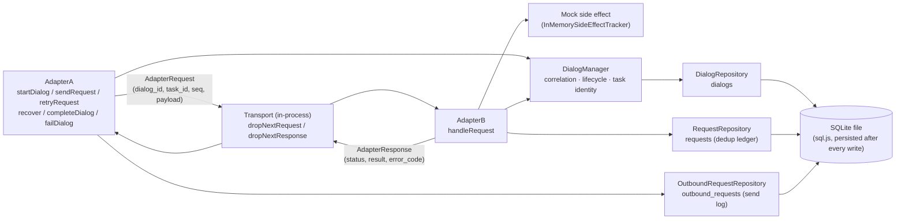
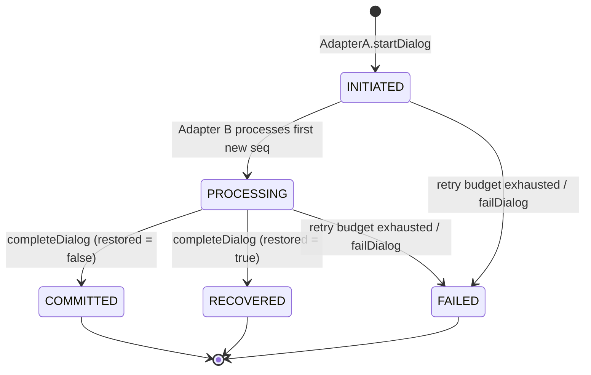
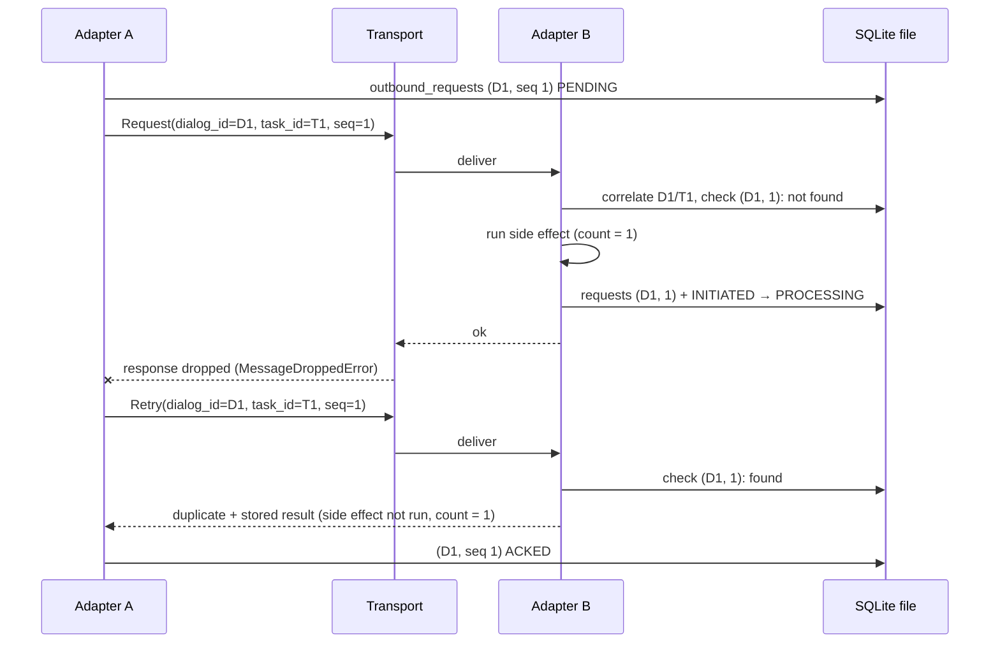
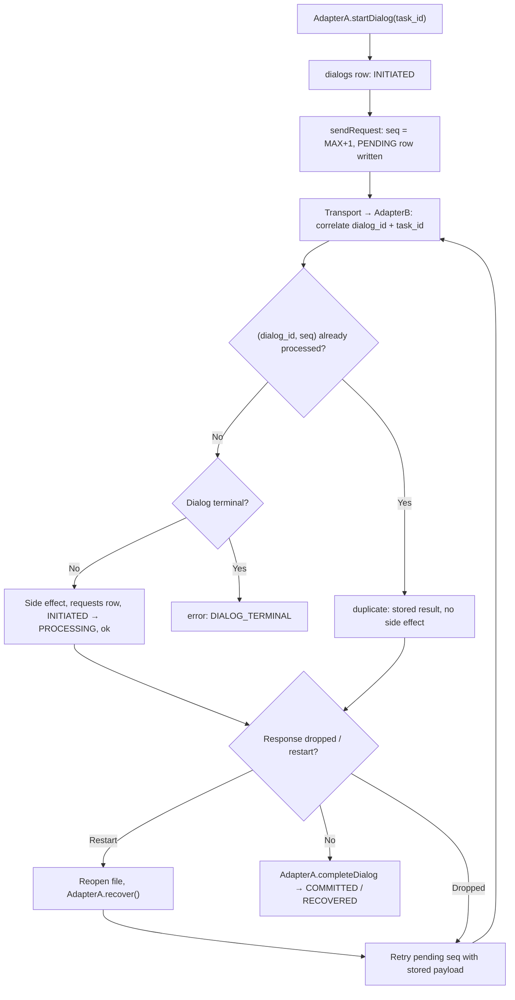

# Nighthawks: Dialog Correlation and Recovery Prototype

**PS-021: Experimental Dialog Correlation and Recovery Across Agent Adapters**
**Team: Nighthawks** | AIORI-3 | Category: 6G & Future Networks

> A prototype that connects two mock agent adapters and shows how explicit dialog IDs, lifecycle states, request deduplication, and durable state let a task survive a disconnect or restart without losing its identity or repeating side effects that were already durably recorded.

> **Status (Phase 10, 2026-10-09).**
>
> **Implemented:** the backend core in `backend/` — two mock adapters, an in-process transport with fault injection, the DialogManager lifecycle service, three SQLite tables via sql.js, deduplication on `(dialog_id, seq)`, Adapter A's durable send log and `recover()`, task completion and failure, and terminal-state protection — plus an HTTP API over it ([Section 19](#19-api--message-format), [`docs/API_DESIGN.md`](docs/API_DESIGN.md)) that can drive dialogs, inject faults, restart adapters, run the five scenarios and stream activity events. The full backend suite is 265 passing tests, and the five scenarios pass both as adapter-level tests and through HTTP ([Section 28](#28-results)). The experimental schema is in [`docs/EXPERIMENTAL_SCHEMA.md`](docs/EXPERIMENTAL_SCHEMA.md). The React dashboard in `Front/frontend/` reads everything from that API (the old in-browser simulation was removed in Phase 8), and browser end-to-end tests (`e2e/`, Playwright + Edge) run the five scenarios and the manual flows through the real UI, Vite proxy, backend and SQLite file ([`docs/TEST_RESULTS.md`](docs/TEST_RESULTS.md)).
>
> **Demo:** a launcher (`node scripts/demo.mjs`), a live text trace (`node scripts/trace.mjs`), a dry-run-verified talk track ([`docs/DEMO_SCRIPT.md`](docs/DEMO_SCRIPT.md)), one-page pseudocode ([`docs/PSEUDOCODE.md`](docs/PSEUDOCODE.md)), and reproducible backup assets (video, screenshots).
>
> **Not yet implemented:** the final deliverables (PDF, repository hand-over).
>
> Sections labelled **Requirement** come from the official Problem Statement. Sections marked **Pending** describe work that has not been done yet.

---

## Table of Contents

1. [Project Overview](#1-project-overview)
2. [Problem Statement](#2-problem-statement)
3. [Why This Problem Matters](#3-why-this-problem-matters)
4. [Key Concepts](#4-key-concepts)
5. [Core Idea of the Solution](#5-core-idea-of-the-solution)
6. [Architecture](#6-architecture)
7. [Component Description](#7-component-description)
8. [Dialog-State Schema](#8-dialog-state-schema)
9. [Lifecycle State Machine](#9-lifecycle-state-machine)
10. [Dialog Correlation](#10-dialog-correlation)
11. [Request Deduplication](#11-request-deduplication)
12. [Durable State and Recovery](#12-durable-state-and-recovery)
13. [Disconnect and Retry Handling](#13-disconnect-and-retry-handling)
14. [Five Disconnect/Retry Test Scenarios](#14-five-disconnectretry-test-scenarios)
15. [Failure and Recovery Matrix](#15-failure-and-recovery-matrix)
16. [End-to-End Workflow](#16-end-to-end-workflow)
17. [Detailed Execution Flow](#17-detailed-execution-flow)
18. [Data Flow](#18-data-flow)
19. [API / Message Format](#19-api--message-format)
20. [Pseudocode](#20-pseudocode)
21. [Technology Stack](#21-technology-stack)
22. [Project Structure](#22-project-structure)
23. [Installation](#23-installation)
24. [Running the Prototype](#24-running-the-prototype)
25. [Running Tests](#25-running-tests)
26. [Demonstration Guide](#26-demonstration-guide)
27. [Expected Demonstration Output](#27-expected-demonstration-output)
28. [Results](#28-results)
29. [Requirements Traceability](#29-requirements-traceability)
30. [Relationship to IETF Agentproto](#30-relationship-to-ietf-agentproto)
31. [MCP and A2A Context](#31-mcp-and-a2a-context)
32. [Design Decisions](#32-design-decisions)
33. [Limitations](#33-limitations)
34. [Future Enhancements](#34-future-enhancements)
35. [Security Considerations](#35-security-considerations)
36. [Observability and Debugging](#36-observability-and-debugging)
37. [Troubleshooting](#37-troubleshooting)
38. [Glossary](#38-glossary)
39. [References](#39-references)
40. [Team](#40-team)
41. [License](#41-license)
42. [Hackathon Deliverables Checklist](#42-hackathon-deliverables-checklist)

---

## 1. Project Overview

### What problem are we solving?

AI agents increasingly work together, passing tasks to one another across different frameworks. These frameworks each keep track of "which conversation is this?" in their own way. When something goes wrong mid-task, such as a network drop or an agent restart, there is often no shared, explicit record of which task a message belongs to or whether it was already handled.

### Why does this problem exist?

There is no single standardized way for agents to track a dialog. Each framework manages conversation context in its own, often proprietary, way. The IETF has an agent-protocol discussion group exploring this space, but nothing there is final.

### What happens when a task is interrupted?

Consider Agent A sending a task to Agent B through adapters, and the connection dropping:

- A does not know whether B received the request.
- If B restarted, B may have forgotten the task entirely.
- A retries, since retrying is the natural reaction to silence.

### Why can context and task identity be lost?

If the dialog and task identity live only in memory, a restart erases them. A retry then arrives with nothing to match it to, and it looks like a brand-new task.

### Why can retries cause duplicate operations?

A retry is indistinguishable from a new request unless the receiver can recognize it. If the original request had already been processed (only the acknowledgement was lost), processing the retry performs the side effect a second time. Examples are sending a message twice, creating two records, or charging twice.

### What does our prototype demonstrate?

It demonstrates, using two mock agent adapters:

- Tasks correlated by an explicit **dialog ID** (`dialog_id`) with a separate **task ID** (`task_id`).
- Explicit **lifecycle states** with valid transitions.
- **Request deduplication** on `(dialog_id, seq)`, so a retry does not repeat a side effect that was already recorded.
- **Durable state** so dialog and task identity survive an adapter restart.
- Behavior across **five simulated disconnect/retry scenarios**.

---

## 2. Problem Statement

**PS-021: Experimental Dialog Correlation and Recovery Across Agent Adapters** (AIORI-3, Category: 6G & Future Networks).

**Challenge (from the Problem Statement):** Build a prototype that correlates tasks across two mock agent adapters using dialog IDs, explicit lifecycle states, request deduplication, and durable recovery after a restart.

### Requirements (official)

| # | Requirement from PS-021 |
|---|---|
| R1 | Implement 2 mock agent adapters. |
| R2 | Use 1 defined dialog-state schema. |
| R3 | Preserve task identity across adapter restarts. |
| R4 | Implement request deduplication to prevent duplicate side effects. |
| R5 | Test 5 disconnect/retry scenarios. |
| R6 | Define explicit lifecycle states and valid state transitions. |
| R7 | Use a mentor-selected, pinned draft or clearly labelled experimental schema. |
| R8 | No claim of final IETF-standard implementation, complete MCP/A2A interoperability, or universal exactly-once delivery. |

### Expected outcomes (official)

- Two working mock adapter implementations
- Dialog-state schema and state machine
- Durable state/recovery mechanism
- Request deduplication mechanism
- Five disconnect/retry test scenarios
- Interoperability and recovery test results
- Demonstration showing task identity preservation and duplicate-side-effect rejection

### Deliverables (official)

1. **GitHub collaboration:** private repository, `aiori-hackathon` added as collaborator, ownership transferred after the request is accepted, repository named after the team.
2. A **PDF uploaded to the repository** following the organizers' *Proposed-structure-hackathon.pdf*.
3. **Prototype demonstration with a pseudocode snippet** shown to the mentor.

### What the Problem Statement does *not* specify

The Problem Statement does **not** prescribe the following. Each is a Nighthawks design choice, documented in this README and in [`docs/EXPERIMENTAL_SCHEMA.md`](docs/EXPERIMENTAL_SCHEMA.md):

- The exact fields of the dialog-state schema (it asks for "1 defined schema", not a specific one)
- The specific lifecycle states and transitions
- The definitions of the five scenarios
- The programming language, storage mechanism, or transport
- The deduplication algorithm

> **R7:** No mentor-selected IETF draft has been pinned. The project uses a **clearly labelled experimental schema**, `v0.1-experimental` ([`docs/EXPERIMENTAL_SCHEMA.md`](docs/EXPERIMENTAL_SCHEMA.md)). If a mentor selects a draft, the schema document must be updated to reference it.

---

## 3. Why This Problem Matters

```text
Agent A
   |
   | Task
   v
Adapter B
   |
   X  Network disconnect
   |
   v
Retry
```

What can go wrong:

| Risk | What happens |
|---|---|
| Lost task context | After a restart, Adapter B has no memory of the task. |
| Unknown task identity | The retry carries no identifier B recognizes, so it looks like a new task. |
| Duplicate request processing | B processes the same logical request twice. |
| Duplicate side effects | The real-world effect (a write, a message, a payment) happens twice. |
| Failure to continue an existing task | The task restarts from scratch instead of resuming. |

PS-021 asks for a prototype in which these failures are prevented using explicit identifiers, explicit states, and persisted records.

---

## 4. Key Concepts

> Definitions below are written for this project. Where a term is used in a general way in the wider industry, we only explain its meaning in PS-021.

### Agent
- **Definition:** A software entity (often AI-driven) that performs tasks and may communicate with other agents.
- **In PS-021:** Both ends of the exchange are *mock* agents, simple stand-ins for real agents. Agent B's "work" is a mock side effect that increments a counter.

### Agent Adapter
- **Definition:** A component that translates between an agent and the communication channel, and manages exchange details for it.
- **In PS-021:** The two mock adapters (`AdapterA`, `AdapterB`) are the main deliverable. They carry dialog identity, track state, and handle retries and restarts.

### Dialog
- **Definition:** A bounded exchange between two parties about a piece of work.
- **In PS-021:** The unit that gets an explicit ID and a lifecycle. One row in the `dialogs` table.

### Dialog ID
- **Definition:** A unique identifier for one dialog.
- **In PS-021:** The correlation key, generated by Adapter A.
- **Example:** `dialog_id = dlg-1791460800000-k3f9q2a`

### Dialog Context
- **Definition:** The minimum information needed to recognize and continue a dialog.
- **In PS-021:** Identifiers (`dialog_id`, `task_id`), lifecycle state, the `restored` flag, and the request records. It is *not* chat history or model memory (see [Section 8](#8-dialog-state-schema)).

### Dialog State
- **Definition:** The recorded current status of a dialog (identity plus lifecycle state, plus bookkeeping).
- **In PS-021:** The record defined by our schema and persisted for recovery.

### Task
- **Definition:** The unit of work one agent asks another to perform.
- **In PS-021:** Its identity (`task_id`) must be preserved across restarts (R3).

### Sequence number (`seq`)
- **Definition:** A number identifying one logical request within a dialog.
- **In PS-021:** Adapter A assigns 1, 2, 3, … per dialog. A retry keeps the same `seq`. `(dialog_id, seq)` is the deduplication key.

### Correlation
- **Definition:** Matching an incoming message to the existing dialog/task it belongs to.
- **In PS-021:** How Adapter B knows a retry belongs to an existing task: look up `dialog_id`, verify `task_id`.

### Lifecycle State
- **Definition:** A named stage in a dialog's life.
- **In PS-021:** Explicitly required (R6). Five states: `INITIATED`, `PROCESSING`, `COMMITTED`, `RECOVERED`, `FAILED`.

### State Transition
- **Definition:** A move from one lifecycle state to another.
- **In PS-021:** Only *valid* transitions are allowed (R6). Others are rejected with `InvalidTransitionError`.

### Retry
- **Definition:** Sending a request again because the outcome of the first attempt is unknown.
- **In PS-021:** The trigger for both correlation and deduplication.

### Disconnect
- **Definition:** Loss of the communication link between the two sides.
- **In PS-021:** Simulated by the transport dropping the next request or the next response.

### Recovery
- **Definition:** Restoring a dialog to a usable state after a failure.
- **In PS-021:** Reopening the SQLite file after a restart; Adapter A's `recover()` resumes active dialogs.

### Durable State
- **Definition:** State stored so that it survives a process restart.
- **In PS-021:** Required to preserve task identity (R3). Stored in one SQLite file.

### Request Deduplication
- **Definition:** Recognizing that a request was already processed and not acting on it again.
- **In PS-021:** Required to prevent duplicate side effects (R4).

### Duplicate Side Effect
- **Definition:** A real effect of processing (a write, an action) that happens more than once for one logical request.
- **In PS-021:** What deduplication exists to prevent.

### Experimental Schema
- **Definition:** A schema that is a working proposal, not a ratified standard.
- **In PS-021:** Our dialog-state schema is experimental and inspired by emerging IETF agent-protocol discussions. It is not a finalized standard.

---

## 5. Core Idea of the Solution

> This flow matches the implementation; the details are in [Section 17](#17-detailed-execution-flow).

```text
Task starts
    ↓
Dialog ID assigned (Adapter A), dialog stored as INITIATED
    ↓
Request (dialog_id, task_id, seq) logged as PENDING, then sent
    ↓
Adapter B correlates request (dialog_id + task_id)
    ↓
Side effect runs once, processed record persisted
    ↓
Disconnect / restart occurs
    ↓
Request is retried with the same identifiers and payload
    ↓
Existing dialog is identified
    ↓
Durable state is recovered (reopen the file, recover())
    ↓
Duplicate request is detected if it was already recorded
    ↓
Task continues safely, then completes as COMMITTED or RECOVERED
```

The idea rests on three simple rules:

1. **Name everything explicitly.** A dialog and a task get IDs, and each request gets a `seq`.
2. **Write it down before relying on it.** State is persisted immediately, so a restart does not erase it.
3. **Check before acting.** Before processing, look up whether this `(dialog_id, seq)` was already handled.

---

## 6. Architecture

Both mock adapters run as modules in **one Node.js process** and share **one sql.js database handle over one SQLite file**. The transport is an in-process function call with fault injection.



Notes:

- **Shared store.** There is one database, not one per adapter. Adapter A creates the dialog row and Adapter B correlates against it.
- **Fixed roles.** Adapter A only sends and Adapter B only receives. The transport delivers A → B only.
- **HTTP.** An Express app exposes the runtime that hosts both adapters (`backend/src/runtime/SimulationRuntime.ts`); routes never touch the adapters or the database directly ([Section 19](#19-api--message-format)).

---

## 7. Component Description

### `AdapterA` (`backend/src/adapters/AdapterA.ts`) — initiating side
Creates dialogs (`startDialog`), assigns `seq` from its durable send log, writes each request as `PENDING` **before** sending, marks it `ACKED` on an `ok` or `duplicate` answer, and retries with the stored payload (`retryRequest`). After a restart, `recover()` resumes active dialogs. It owns completion (`completeDialog` → `COMMITTED`/`RECOVERED`) and failure (retry budget, `failDialog` → `FAILED`), and refuses new requests on terminal dialogs.

### `AdapterB` (`backend/src/adapters/AdapterB.ts`) — receiving side
Registers itself as the transport's request handler. For each request it correlates, checks `(dialog_id, seq)` for a duplicate, rejects new work on terminal dialogs, runs the mock side effect, records the processed request, moves `INITIATED → PROCESSING`, and responds with `ok`, `duplicate` or `error` (+ `error_code`).

### `Transport` (`backend/src/adapters/Transport.ts`)
An in-process delivery mechanism with one registered handler (Adapter B). `dropNextRequestMessage()` makes the next request fail before B sees it; `dropNextResponseMessage()` lets B process it and then drops the answer. Both raise `MessageDroppedError` to the sender. It contains no dialog logic.

### `DialogManager` (`backend/src/services/DialogManager.ts`)
Business rules for dialogs: create, look up, `correlate(dialog_id, task_id)`, validated `transition`, `markRestored`, `transitionToRecovered`. It does not do deduplication.

### Repositories (`backend/src/repositories/`)
SQL only, persisted after every mutation:
- `DialogRepository` — `dialogs` table
- `RequestRepository` — `requests` table, Adapter B's processed-request ledger (dedup source of truth)
- `OutboundRequestRepository` — `outbound_requests` table, Adapter A's send log

### Database (`backend/src/db/`)
`schema.sql` defines the three tables. `index.ts` loads the sql.js WebAssembly engine, reads the file into memory, applies the schema, and `persistToDisk()` writes the database back to the file.

### Mock side effect
`AdapterB.executeMockSideEffect` increments a per-dialog counter (`InMemorySideEffectTracker`) and returns `{ processed: true, payload, timestamp }`. Counting how often it ran is how the tests show duplicates are rejected.

### Test layer (`backend/tests/`)
Vitest suites that inject drops and restarts and assert outcomes. A "restart" closes the database handle and boots fresh adapters from the same file.

### Frontend (`Front/frontend/`)
A React dashboard driven entirely by the HTTP API: `src/api/useBackendEngine.js` polls events, state and ledgers, and `src/components/ManualControls.jsx` sends one API call per button (new task, send with an optional lost request/reply, retry, duplicate, complete, abort, restart). It shows the backend's five lifecycle states and holds no experiment state of its own. See `Front/frontend/README.md`.

---

## 8. Dialog-State Schema

The schema is **experimental, `v0.1-experimental`, not a standard, not MCP, not A2A**. The full definition, with field types, constraints and JSON examples, is in **[`docs/EXPERIMENTAL_SCHEMA.md`](docs/EXPERIMENTAL_SCHEMA.md)**.

Summary:

| Record | Table | Key | Fields |
|---|---|---|---|
| Dialog | `dialogs` | `dialog_id` | `dialog_id`, `task_id`, `state`, `restored` |
| Processed request (Adapter B) | `requests` | `(dialog_id, seq)` | `processed_at`, `result` (JSON) |
| Outbound request (Adapter A) | `outbound_requests` | `(dialog_id, seq)` | `payload` (JSON), `status` (`PENDING`/`ACKED`), `attempts` |

### Why each element exists

- **Why a dialog ID exists:** So both sides name the same exchange explicitly instead of inferring it from connection or session.
- **Why task identity matters:** After a restart, the system must resume the *same* task, not create a new one.
- **Why lifecycle state matters:** It tells the adapter what is allowed next (a finished dialog accepts no new work).
- **Why a send log exists:** So Adapter A can derive the next `seq`, find in-flight requests, and replay the exact payload after its own restart.

### Information needed for correlation
`dialog_id`, with `task_id` as a consistency check.

### Information needed for recovery
`dialog_id`, `task_id`, `state`, `restored`, the processed-request ledger, and Adapter A's send log.

### Deliberately NOT part of dialog context

- Conversation history or message transcripts
- AI model memory or prompts
- Agent reasoning or internal state
- A separate `request_id` (`(dialog_id, seq)` is the request identity)

> Dialog state is a small coordination record. It is not a conversation log and not model memory.

---

## 9. Lifecycle State Machine

Five states, defined in `backend/src/types/index.ts` and enforced by `DialogManager`.



### States

| State | Meaning | Terminal |
|---|---|---|
| `INITIATED` | Dialog created, no request processed yet | No |
| `PROCESSING` | At least one request processed, task ongoing | No |
| `COMMITTED` | Task completed by Adapter A, dialog never restored | Yes |
| `RECOVERED` | Task completed by Adapter A after a restart and `recover()` | Yes |
| `FAILED` | Retry budget exhausted, or explicit `failDialog` | Yes |

### Valid transitions

| From | To | Triggered by |
|---|---|---|
| — | `INITIATED` | `AdapterA.startDialog(taskId)` |
| `INITIATED` | `PROCESSING` | Adapter B, on the first new `(dialog_id, seq)` |
| `INITIATED` / `PROCESSING` | `FAILED` | Adapter A: a dropped message for a `PENDING` request that has used `maxAttempts` attempts (default 5), or `failDialog(id, reason)` |
| `PROCESSING` | `COMMITTED` | `AdapterA.completeDialog` when `restored = false` and nothing is `PENDING` |
| `PROCESSING` | `RECOVERED` | `AdapterA.completeDialog` when `restored = true` and nothing is `PENDING` |

### Invalid transitions (examples)

- `INITIATED → COMMITTED` / `INITIATED → RECOVERED` (no work done yet)
- `PROCESSING → INITIATED`
- Anything out of `COMMITTED`, `RECOVERED` or `FAILED`

Invalid transitions throw `InvalidTransitionError` (`DialogManager.test.ts`, Tests 6–7).

### Why explicit lifecycle management is required
Without explicit states, an adapter cannot answer "what do I do with this request?". A request for an already-processed `seq` on a finished dialog returns the recorded result; a request for a new `seq` on a finished dialog is rejected (`DIALOG_TERMINAL`).

---

## 10. Dialog Correlation

> **Question:** How does Adapter B know that an incoming request belongs to an existing task/dialog?

**Answer:** Every request carries explicit identifiers. Adapter B calls `DialogManager.correlate(dialog_id, task_id)`, which looks up the dialog by `dialog_id` and checks that `task_id` matches the stored value.

| Identifier | Role |
|---|---|
| `dialog_id` | Which dialog this request belongs to (correlation key). |
| `task_id` | Which task the dialog carries. Consistency check. |
| `seq` | Which logical request within the dialog. With `dialog_id`, the dedup key. |

```text
Request
dialog_id = D1
task_id   = T1
seq       = 1

Retry
dialog_id = D1
task_id   = T1
seq       = 1      <- same logical request
```

Because the retry carries the same `dialog_id` and `task_id`, B finds the existing record, even after a restart (the record is read from the SQLite file), and associates the retry with the existing dialog instead of creating a new one. `D2`/seq 1 is a different request from `D1`/seq 1 (Scenario 1).

Policy:
- `dialog_id` unknown → `error`, `DIALOG_NOT_FOUND`. Adapter B never creates dialogs.
- `task_id` differs → `error`, `TASK_MISMATCH`.

---

## 11. Request Deduplication

- **Duplicate request:** A request whose `(dialog_id, seq)` has already been processed.
- **Why retries create duplicates:** The sender cannot tell "request lost" from "response lost", so it resends.
- **Why duplicate processing is dangerous:** The side effect runs twice.
- **How the prototype detects duplicates:** Adapter B looks up `(dialog_id, seq)` in the `requests` table, which is written to disk immediately after the side effect.
- **How duplicate side effects are rejected:** If the record exists, B returns `status: "duplicate"` with the stored result and does *not* run the side effect. This also holds on a terminal dialog (idempotent replay).

```text
receive request
       ↓
correlate (dialog_id, task_id)
       ↓
(dialog_id, seq) already processed?
   /          \
 yes           no
 ↓              ↓
return stored   dialog terminal?
result            /       \
(duplicate)     yes        no
                 ↓          ↓
           error          run side effect
           DIALOG_TERMINAL     ↓
                          persist processed record
                               ↓
                          respond ok
```

### The ordering problem

The window between "run side effect" and "persist record" is **not closed**. If Adapter B runs the side effect and crashes before the record is written, a retry runs it again. The guarantee is therefore **duplicate-side-effect prevention when the original request has already been durably recorded as processed**. We do **not** claim universal exactly-once delivery.

---

## 12. Durable State and Recovery

### Runtime state
Held in memory while the process runs and lost on restart: the set of dialogs Adapter A is driving, the transport's drop flags, the side-effect counter, and the sql.js in-memory copy of the database.

### Durable state
The SQLite file. sql.js keeps the database in memory, and after **every** mutation (`create`, `updateState`, `record`, `recordPending`, `markAcked`, `incrementAttempts`) the whole database is written to the file.

### Recovery flow

```text
Process running, every write persisted to the file
     ↓
"Restart": all in-memory objects discarded
     ↓
openDatabase(file) — file read back into memory
     ↓
Adapter B: correlation + dedup work immediately (they read the tables)
     ↓
Adapter A: recover()
   - every INITIATED / PROCESSING dialog → restored = true, driven again
   - nextSeq = MAX(seq in send log) + 1
   - pendingSeqs = PENDING rows (retry them with the stored payload)
     ↓
Retries are correlated and deduplicated; the task continues
     ↓
completeDialog → RECOVERED
```

Terminal dialogs are never resumed by `recover()` (`recovery.test.ts`, `lifecycle.test.ts`).

---

## 13. Disconnect and Retry Handling

| Term | Meaning here |
|---|---|
| **Disconnect** | The transport drops the next request (B never sees it) or the next response (B processed it, A never hears back). A receives `MessageDroppedError`. |
| **Retry** | `AdapterA.retryRequest(dialog_id, seq)` resends the same identifiers and stored payload. |
| **Correlation** | Adapter B matches the retry to the existing dialog by `dialog_id` + `task_id`. |
| **Recovery** | After a restart, the file is reopened and Adapter A runs `recover()`. |
| **Deduplication** | Adapter B returns the stored result for an already-processed `(dialog_id, seq)`. |



---

## 14. Five Disconnect/Retry Test Scenarios

The five approved scenarios are automated tests in `backend/tests/scenarios.test.ts`. Each one uses the real adapters, transport, DialogManager, repositories and a real SQLite file.

| # | Scenario (test `describe`) | What fails | Retried / restarted | Expected correlation | Expected dedup / recovery | Final lifecycle state |
|---|---|---|---|---|---|---|
| 1 | **Multiple Dialogs + Retry → Correct Correlation** | D1/T1 and D2/T2 exist; D2's seq 1 request is dropped | A retries D2/seq 1 | Retry correlated to D2/T2, not D1 | Not a duplicate (original never arrived): processed once; D1 side effects = 0 | D2 `COMMITTED`; untouched D1 stays `INITIATED` |
| 2 | **Request Lost → Retry** | seq 1 request dropped before B | A retries seq 1 | Same dialog | Processed once on the retry | `COMMITTED` |
| 3 | **Response Lost → Duplicate Request** | B processes seq 1, response dropped | A retries seq 1 | Same dialog | `duplicate`; side-effect count stays 1 | `COMMITTED` |
| 4 | **Adapter B Restart → Durable State Recovery** | B processes seq 1, response dropped, then full restart | Reopen file; A `recover()` (nextSeq 2, pending [1]); retry seq 1 | Dialog, task and `PROCESSING` state reloaded | `duplicate` with the stored result; restarted B runs no side effect | `RECOVERED` (`restored = true`) |
| 5 | **Mid-Task Disconnect + Adapter A Restart → Resume** — *response-lost* variant | seq 1, 2 ok; seq 3 processed, response dropped; A restarts | `recover()` → nextSeq 4, pending [3]; retry 3 and 1; send seq 4 | Same `dialog_id`/`task_id`; no new dialog | seq 3 and 1 `duplicate`; seq 4 processed once | `RECOVERED` |
| 5 | *request-lost* variant | seq 1, 2 ok; seq 3 dropped before B; A restarts | `recover()` → nextSeq 4, pending [3]; retry 3; send seq 4 | Same dialog | seq 3 processed once (first arrival); seq 4 once | `RECOVERED` |

In every scenario `nextSeq` comes from durable state; no test passes it in. Results: [Section 28](#28-results).

---

## 15. Failure and Recovery Matrix

| Failure | What is lost? | What remains? | Recovery action | Result | Scenario |
|---|---|---|---|---|---|
| Request lost | The request | A's `PENDING` row | A retries same `(dialog_id, seq)` + payload | Processed once | 1, 2, 5 (request-lost) |
| Response lost | The answer to A | B's `requests` row; A's `PENDING` row | A retries; B returns stored result | `duplicate`, no repeated side effect | 3, 4, 5 (response-lost) |
| Process restart (B's view) | All in-memory objects | `dialogs`, `requests` | Reopen the file | Correlation and dedup continue | 4 |
| Process restart (A's view) | A's set of driven dialogs | `dialogs`, `outbound_requests` | `recover()` | Same IDs, nextSeq from disk, pending retried | 4, 5 |
| Retry budget exhausted | — | All rows | Dialog moved to `FAILED` | New requests refused; processed seqs still replay | `lifecycle.test.ts` |
| New request on a finished dialog | — | All rows | Rejected | A: `DialogTerminalError`; B: `DIALOG_TERMINAL` | `lifecycle.test.ts` |
| Crash between side effect and B's persist | B's processed record | A's `PENDING` row | A retries | **Side effect runs again** — known limitation | not tested |
| Crash during the file write | Possibly the file | — | None | **File may be corrupted** — known limitation | not tested |

---

## 16. End-to-End Workflow



---

## 17. Detailed Execution Flow

1. `AdapterA.startDialog(task_id)` generates a `dialog_id` and inserts the dialog as `INITIATED`.
2. `AdapterA.sendRequest(dialog_id, payload)` refuses terminal dialogs, sets `seq = MAX(seq) + 1`, and writes `(dialog_id, seq, payload)` as `PENDING`.
3. The `Transport` either drops the request, or calls `AdapterB.handleRequest`.
4. Adapter B correlates `dialog_id` + `task_id` (`DIALOG_NOT_FOUND` / `TASK_MISMATCH` on failure).
5. B checks `(dialog_id, seq)` in `requests`. If found → `duplicate` with the stored result.
6. If the dialog is terminal → `error`, `DIALOG_TERMINAL`.
7. Otherwise B runs the mock side effect, records `(dialog_id, seq, processed_at, result)`, and moves `INITIATED → PROCESSING`.
8. B responds `ok`. The transport may drop the response.
9. Adapter A marks the request `ACKED` on `ok` or `duplicate`. On a drop it keeps `PENDING`; if `attempts >= maxAttempts` the dialog becomes `FAILED`.
10. A retry (`retryRequest`) resends the same `dialog_id`, `task_id`, `seq` and stored payload and increments `attempts`.
11. After a restart, the file is reopened and `AdapterA.recover()` resumes active dialogs (`restored = true`, nextSeq, pendingSeqs).
12. When the task is done, `AdapterA.completeDialog` → `COMMITTED` (never restored) or `RECOVERED` (restored). It refuses while anything is `PENDING`.

---

## 18. Data Flow

### Identity information
```text
dialog_id   (Adapter A, startDialog)
task_id     (caller of startDialog)
```

### Lifecycle information
```text
state       INITIATED | PROCESSING | COMMITTED | RECOVERED | FAILED
restored    true after AdapterA.recover()
```

### Request information
```text
seq         (Adapter A: MAX(seq) + 1 per dialog)
payload     (mock business payload, stored in Adapter A's send log)
```

### Persistent information

- `dialogs` — identity, lifecycle state, `restored`
- `requests` — Adapter B's processed requests and stored results
- `outbound_requests` — Adapter A's sent requests, `PENDING`/`ACKED`, payload, attempts

---

## 19. API / Message Format

> **Communication between the adapters is in-process.** Messages are TypeScript objects passed through `Transport`; there is no network encoding. No MCP or A2A endpoint exists.

Types: `backend/src/adapters/types.ts`. Full field tables: [`docs/EXPERIMENTAL_SCHEMA.md` §4](docs/EXPERIMENTAL_SCHEMA.md).

### HTTP API (implemented, Phase 6)

The HTTP API controls the runtime that hosts both adapters. Full contract, outcome model and error codes: [`docs/API_DESIGN.md`](docs/API_DESIGN.md).

| Method | Path | Purpose |
|---|---|---|
| GET | `/health` | Liveness |
| GET | `/api/state` | Snapshot: dialogs, metrics, node status, runtime info |
| GET | `/api/dialogs`, `/api/dialogs/:dialogId` | Dialog summaries / one dialog with processed requests, send log, per-seq ledger |
| POST | `/api/dialogs` | Start a dialog for a `task_id` |
| POST | `/api/dialogs/:dialogId/requests` | Send the next request (optional `fault`: `drop_request` \| `drop_response`) |
| POST | `/api/dialogs/:dialogId/requests/:seq/retry` | Retry a seq with its stored payload |
| POST | `/api/dialogs/:dialogId/complete` / `fail` | → `COMMITTED`/`RECOVERED` / → `FAILED` |
| POST | `/api/adapters/:adapter/restart` | `A` or `B`: full process restart from the SQLite file + `recover()` |
| GET | `/api/scenarios` | The five scenarios and the last result of each |
| POST | `/api/scenarios/:id/run` | Run a scenario on the live runtime |
| GET | `/api/events?since=` | Activity events after a cursor (polling) |
| POST | `/api/reset` | Demo-only wipe, body `{"confirm":"RESET"}` |

Simulated drops are reported as `200` with `delivery`/`outcome` fields, not as HTTP errors. Errors share one shape: `{ error, message, status, details? }`.

### Request message (`AdapterRequest`)

```json
{
  "dialog_id": "dlg-1791460800000-k3f9q2a",
  "task_id": "task-scenario5",
  "seq": 3,
  "payload": { "step": 3 }
}
```

### Response message (`AdapterResponse`)

```json
{
  "dialog_id": "dlg-1791460800000-k3f9q2a",
  "task_id": "task-scenario5",
  "seq": 3,
  "status": "duplicate",
  "result": { "processed": true, "payload": { "step": 3 }, "timestamp": "2026-10-08T07:30:00.000Z" }
}
```

| Field | Present | Notes |
|---|---|---|
| `dialog_id` | Request + response | Correlation key |
| `task_id` | Request + response | Task identity |
| `seq` | Request + response | With `dialog_id`, the dedup key |
| `payload` | Request | Mock business payload |
| `status` | Response | `ok` \| `duplicate` \| `error` |
| `result` | Response | New result, stored result, or `null` on error |
| `error` | Response, on `error` | Human-readable message |
| `error_code` | Response, on `error` | See below |

### Error cases (`error_code`)

| Code | Meaning |
|---|---|
| `DIALOG_NOT_FOUND` | `dialog_id` not found |
| `TASK_MISMATCH` | `task_id` conflicts with the stored dialog |
| `DIALOG_TERMINAL` | Dialog is finished and this `(dialog_id, seq)` was never processed |
| `INTERNAL` | Any other failure |

### Retry behavior
Retries reuse the same `dialog_id`, `task_id`, `seq` and payload. There is no timer or backoff: retries are issued explicitly by the caller (tests, or `POST …/requests/:seq/retry`). After `maxAttempts` (default 5) unanswered attempts of a `PENDING` request, the dialog becomes `FAILED`.

---

## 20. Pseudocode

The full one-page version, with a source pointer for every block, is **[`docs/PSEUDOCODE.md`](docs/PSEUDOCODE.md)**. The core, from `AdapterA.ts` and `AdapterB.ts`:

```text
sendRequest(dialog_id, payload):                 # Adapter A
    seq = send_log.max_seq(dialog_id) + 1         # next seq from durable state
    send_log.insert(seq, payload, PENDING)        # persisted before sending
    deliver(dialog_id, task_id, seq, payload)     # ok/duplicate → ACKED

retryRequest(dialog_id, seq):                     # same ids, same stored payload
    deliver(dialog_id, task_id, seq, send_log.get(seq).payload)

handleRequest(req):                               # Adapter B, in this order
    dialog = correlate(req.dialog_id, req.task_id)
    if processed.has(req.dialog_id, req.seq): return duplicate(stored result)
    if dialog is terminal: return error(DIALOG_TERMINAL)
    result = run_side_effect(req.payload)         # <-- crash window opens
    processed.insert(req.dialog_id, req.seq, result)   # persisted; window closes
    if dialog.state == INITIATED: transition(PROCESSING)
    return ok(result)

recover():                                        # every restart / server start
    for each INITIATED/PROCESSING dialog: restored = true,
        next_seq = send_log.max_seq + 1, pending_seqs = send_log.pending
```

Known gap: the window between `run_side_effect` and `processed.insert`. See [Section 11](#11-request-deduplication).

---

## 21. Technology Stack

| Area | Choice | Why |
|---|---|---|
| Language / runtime | Node.js + TypeScript (strict) | Typed schema and state machine; same runtime as the frontend tooling |
| HTTP framework | Express 4 | Simple; serves the API in `backend/src/http/` |
| Durable storage | SQLite file via **sql.js** 1.12 (WebAssembly) | Embedded, file-based, survives restarts, no server. A native driver (better-sqlite3) was not used because it needs a C++ build toolchain that is not available on the development machine. |
| Validation | zod | Runtime schemas for the record types (API boundaries later) |
| Transport between adapters | In-process `Transport` class | Deterministic fault injection; not a real MCP/A2A transport |
| Test framework | Vitest 1.6 (+ supertest for `/health`) | Runs the five scenarios and unit suites |
| Frontend | React 18, Vite 5, Tailwind CSS 3 | Dashboard over the backend HTTP API |
| Diagrams | Mermaid | Renders natively on GitHub |

---

## 22. Project Structure

```text
Nighthawks/
├── README.md
├── KIRO_PROJECT_CONTEXT.md        # internal project-context notes
├── docs/
│   └── EXPERIMENTAL_SCHEMA.md     # R7: experimental dialog-state schema v0.1
├── backend/
│   ├── package.json
│   ├── tsconfig.json
│   ├── vitest.config.ts
│   ├── src/
│   │   ├── server.ts              # entry point: opens DB, starts Express
│   │   ├── app.ts                 # Express app: /health + /api routes
│   │   ├── config/index.ts        # PORT, DB_PATH, LOG_LEVEL
│   │   ├── logger.ts              # JSON-line logger
│   │   ├── errors.ts              # AppError and subclasses
│   │   ├── types/index.ts         # lifecycle, transition table, record types
│   │   ├── db/
│   │   │   ├── index.ts           # sql.js engine, open, persistToDisk
│   │   │   └── schema.sql         # dialogs, requests, outbound_requests
│   │   ├── repositories/          # Dialog, Request, OutboundRequest repositories
│   │   ├── services/
│   │   │   └── DialogManager.ts   # correlation + lifecycle
│   │   ├── runtime/               # SimulationRuntime, EventLog, ObservedTransport
│   │   ├── http/                  # routes, zod validation, error mapping
│   │   ├── scenarios/             # the five scenario scripts + runner
│   │   └── adapters/
│   │       ├── AdapterA.ts
│   │       ├── AdapterB.ts
│   │       ├── Transport.ts
│   │       └── types.ts           # AdapterRequest / AdapterResponse
│   └── tests/
│       ├── scenarios.test.ts      # the five scenarios (adapter level)
│       ├── scenarioRunner.test.ts # the five scenarios on the live runtime
│       ├── scenariosApi.test.ts   # E11/E12 + the five scenarios as HTTP calls
│       ├── api.test.ts            # every other endpoint, error mapping
│       ├── runtime.test.ts        # SimulationRuntime
│       ├── lifecycle.test.ts      # completion, failure, terminal guards
│       ├── recovery.test.ts       # send log + recover()
│       ├── adapters.test.ts, DialogManager.test.ts, storage.test.ts
│       ├── observedTransport.test.ts, eventlog.test.ts, queries.test.ts
│       └── health.test.ts
└── Front/
    └── frontend/                  # React dashboard over the backend API
        ├── src/
        │   ├── App.jsx
        │   ├── api/               # client, useBackendEngine, mappers, messages
        │   ├── components/        # panels, ManualControls
        │   └── lib/               # constants, narrate, format
        └── tests/                 # mappers, messages, backendEngine (+ fixtures)
```

The organizers' *Proposed-structure-hackathon.pdf* layout has not yet been applied (Phase 11).

---

## 23. Installation

Prerequisites: Node.js 20 or newer and npm. (Verified on Node.js v24.14.1.) No database server is needed.

```bash
git clone <repository-url>
cd Nighthawks
```

Backend:

```bash
cd backend
npm install
```

Frontend (dashboard; needs the backend running):

```bash
cd Front/frontend
npm install
```

Configuration (environment variables, all optional; `backend/src/config/index.ts`):

| Variable | Default | Meaning |
|---|---|---|
| `PORT` | `3001` | HTTP port of the health server |
| `DB_PATH` | `<cwd>/dialogs.db` | SQLite file; created on first start |
| `LOG_LEVEL` | `info` | `debug` \| `info` \| `warn` \| `error` |
| `NODE_ENV` | `development` | `test` suppresses log output |

Storage initialization is automatic: the schema is applied (`CREATE TABLE IF NOT EXISTS`) every time the file is opened.

---

## 24. Running the Prototype

Backend API server (development, auto-reload):

```bash
cd backend
npm run dev
```

It listens on `PORT` (default `3001`) and uses the SQLite file `DB_PATH` (default `dialogs.db` in the working directory; `:memory:` is refused). Compiled alternative: `npm run build` then `npm start`.

Examples (from another terminal; replace `<dialog_id>` with the id returned by the first call):

```bash
curl -s -X POST localhost:3001/api/dialogs -H 'content-type: application/json' -d '{"task_id":"task-demo-1"}'
```

```bash
curl -s -X POST localhost:3001/api/dialogs/<dialog_id>/requests -H 'content-type: application/json' -d '{"payload":{"op":"charge"},"fault":"drop_response"}'
```

```bash
curl -s -X POST localhost:3001/api/dialogs/<dialog_id>/requests/1/retry -H 'content-type: application/json' -d '{}'
```

```bash
curl -s -X POST localhost:3001/api/scenarios/4/run -H 'content-type: application/json' -d '{}'
```

The retry returns `"outcome":"duplicate"`; the scenario run returns its steps, checks and final states.

**Demo launcher (recommended for presenting).** One command starts the backend on `3001` with a fresh demo database (`.demo/demo.db`, gitignored) and the dashboard on `5173` with presenter pacing; Ctrl+C stops both. Options: `--keep-db`, `--pace <ms>`, `--backend-only`, `--frontend-only`. It refuses to start if a port is busy. A live text trace of the backend events: `node scripts/trace.mjs`. See [Section 26](#26-demonstration-guide).

```bash
node scripts/demo.mjs
```

Dashboard by hand (start the backend first; Vite proxies `/api` and `/health` to `VITE_BACKEND_URL`, default `http://localhost:3001`):

```bash
cd Front/frontend
npm run dev
```

Open the URL Vite prints (default `http://localhost:5173`). The demonstration cards run the backend scenarios; the manual controls call the API directly.

---

## 25. Running Tests

Backend (from `backend/`):

| Group | Command | Expected |
|---|---|---|
| All tests | `npm test` | 14 files, 265 tests pass |
| Five scenarios, adapter level | `npx vitest run tests/scenarios.test.ts` | 8 tests pass |
| Five scenarios on the live runtime | `npx vitest run tests/scenarioRunner.test.ts` | 13 tests pass |
| Five scenarios via HTTP + E11/E12 | `npx vitest run tests/scenariosApi.test.ts` | 19 tests pass |
| HTTP API (all other endpoints, errors) | `npx vitest run tests/api.test.ts` | 41 tests pass |
| Runtime / events / transport | `npx vitest run tests/runtime.test.ts tests/eventlog.test.ts tests/observedTransport.test.ts` | 26 + 8 + 11 pass |
| Lifecycle / terminal guards | `npx vitest run tests/lifecycle.test.ts` | 30 tests pass |
| Recovery (send log, `recover()`) | `npx vitest run tests/recovery.test.ts` | 18 tests pass |
| Deduplication / adapters | `npx vitest run tests/adapters.test.ts` | 29 tests pass |
| Type check | `npm run typecheck` | No errors |

Frontend (from `Front/frontend/`): `npm test` runs `tests/mappers.mjs` (mappers against captured backend responses), `tests/messages.mjs` (user-facing texts) and `tests/backendEngine.mjs` (the polling hook, manual controls and the whole App in jsdom against a scripted fake `fetch`). No backend is needed.

| Level | Where | Command | Expected |
|---|---|---|---|
| Frontend unit | `Front/frontend/` | `npm test` | mappers 33, messages 8, backendEngine 24 checks pass |
| Frontend build / lint | `Front/frontend/` | `npm run build`, `npm run lint` | build OK, 0 warnings |
| Client smoke vs a running backend | `Front/frontend/` | `BACKEND_URL=http://localhost:3001 node tests/backend-smoke.mjs` | 6 smoke steps pass (also run inside the E2E suite) |
| Browser end-to-end | `e2e/` | `npm install` once, then `npm run e2e` (or `npm run e2e:headed`) | 16 tests pass; ports 3101/5199 free afterwards |
| Trace formatter | repo root | `node scripts/trace.test.mjs` | 6 checks pass (every backend event type mapped) |

The E2E run starts its own backend (port 3101, fresh temp database file) and Vite (port 5199), uses the installed Microsoft Edge (no browser download), and cleans up after itself; see [`e2e/README.md`](e2e/README.md).

---

## 26. Demonstration Guide

The full 7–8 minute talk track, setup checklist, Q&A and fallback plan is **[`docs/DEMO_SCRIPT.md`](docs/DEMO_SCRIPT.md)**. Short version:

1. `node scripts/demo.mjs` — backend on `3001` (fresh `.demo/demo.db`) + dashboard on `5173`, scenario pace 900 ms. For the optional real-process-kill step, start `--backend-only` and `--frontend-only` in two terminals instead.
2. `node scripts/trace.mjs` in a terminal beside the browser — one readable line per backend event ([Section 27](#27-expected-demonstration-output)).
3. In the dashboard: new task → send → lose the request → retry → lose the reply → retry (**duplicate blocked, work NOT repeated**) → Scenario 1 card (correlation) → lose a reply → **Restart Adapter A** (reloaded with the same ids, `next_seq` and the unanswered seq) → retry (duplicate) → send → complete (**RECOVERED**) → **Run all five** (5 of 5 passed).
4. Close with the pseudocode ([`docs/PSEUDOCODE.md`](docs/PSEUDOCODE.md)), the test results ([`docs/TEST_RESULTS.md`](docs/TEST_RESULTS.md)) and the limitations ([Section 33](#33-limitations)).

Backup assets: `cd e2e && npm run demo:record` (video of the talk track, `e2e/demo-output/`) and `npm run demo:screenshots` (`docs/assets/screenshots/`).

---

## 27. Expected Demonstration Output

**Real output**, captured with `node scripts/trace.mjs` (default: new events only) during the demo dry run on 2026-10-09: launcher started with `--backend-only` and `--frontend-only`, every action clicked in the dashboard as in [`docs/DEMO_SCRIPT.md`](docs/DEMO_SCRIPT.md). Shown: steps 1–4, 6 and the real process kill of step 7; the Scenario 1 and "Run all five" lines (scenario steps and `PASS · …` checks) are left out for length. Labels: `[A]` Adapter A, `[B]` Adapter B, `[net]` the transport, `[rt]` the runtime, `[trace]` the trace tool itself.

```text
12:19:47.043 [A]    startDialog task_id=order-1001 → dialog_id=dlg-1791528587040-ygig9jy INITIATED
12:20:41.415 [A]    send seq=1 → send log PENDING   (dlg-…ygig9jy)
12:20:41.418 [B]    (dlg-…ygig9jy,1) new → processed (processed_count=1); INITIATED → PROCESSING
12:20:41.418 [net]  reply for seq 1 delivered to A (status ok)   (dlg-…ygig9jy)
12:20:41.420 [A]    seq 1 acknowledged → send log ACKED   (dlg-…ygig9jy)
12:20:42.492 [A]    send seq=2 → send log PENDING   (dlg-…ygig9jy)
12:20:42.493 [net]  request for seq 2 LOST — B never saw it   (dlg-…ygig9jy)
12:20:43.566 [A]    retry seq=2 (attempt 2) — same dialog_id, task_id, seq and stored payload   (dlg-…ygig9jy)
12:20:43.569 [B]    (dlg-…ygig9jy,2) new → processed (processed_count=2)
12:20:43.569 [net]  reply for seq 2 delivered to A (status ok)   (dlg-…ygig9jy)
12:20:43.571 [A]    seq 2 acknowledged → send log ACKED   (dlg-…ygig9jy)
12:20:44.644 [A]    send seq=3 → send log PENDING   (dlg-…ygig9jy)
12:20:44.646 [B]    (dlg-…ygig9jy,3) new → processed (processed_count=3)
12:20:44.646 [net]  reply for seq 3 LOST — B already did the work (B status ok)   (dlg-…ygig9jy)
12:20:45.702 [A]    retry seq=3 (attempt 2) — same dialog_id, task_id, seq and stored payload   (dlg-…ygig9jy)
12:20:45.704 [B]    (dlg-…ygig9jy,3) already processed → DUPLICATE, work NOT repeated, stored answer returned
12:20:45.704 [net]  reply for seq 3 delivered to A (status duplicate)   (dlg-…ygig9jy)
12:20:45.706 [A]    seq 3 acknowledged → send log ACKED   (dlg-…ygig9jy)
   … Scenario 1 (step 5) omitted …
12:21:29.258 [A]    send seq=4 → send log PENDING   (dlg-…ygig9jy)
12:21:29.259 [B]    (dlg-…ygig9jy,4) new → processed (processed_count=4)
12:21:29.259 [net]  reply for seq 4 LOST — B already did the work (B status ok)   (dlg-…ygig9jy)
12:21:30.319 [rt]   PROCESS RESTART (target A) — both adapters rebuilt from the SQLite file
12:21:30.322 [A]    recovered dlg-1791528587040-ygig9jy task_id=order-1001 state=PROCESSING next_seq=5 pending=[4]
12:21:30.322 [A]    recovered dlg-1791528654047-wj3gubg task_id=s1-rmv0lwkimcc3a-T1 state=INITIATED next_seq=1 pending=[]
12:21:30.322 [rt]   restart complete — both adapters rebuilt from the SQLite file
12:21:32.374 [A]    retry seq=4 (attempt 2) — same dialog_id, task_id, seq and stored payload   (dlg-…ygig9jy)
12:21:32.376 [B]    (dlg-…ygig9jy,4) already processed → DUPLICATE, work NOT repeated, stored answer returned
12:21:32.376 [net]  reply for seq 4 delivered to A (status duplicate)   (dlg-…ygig9jy)
12:21:32.377 [A]    seq 4 acknowledged → send log ACKED   (dlg-…ygig9jy)
12:21:33.470 [A]    send seq=5 → send log PENDING   (dlg-…ygig9jy)
12:21:33.471 [B]    (dlg-…ygig9jy,5) new → processed (processed_count=5)
12:21:33.471 [net]  reply for seq 5 delivered to A (status ok)   (dlg-…ygig9jy)
12:21:33.472 [A]    seq 5 acknowledged → send log ACKED   (dlg-…ygig9jy)
12:21:34.530 [A]    dlg-…ygig9jy PROCESSING → RECOVERED (completeDialog)
12:21:43.809 [A]    startDialog task_id=order-1002 → dialog_id=dlg-1791528703807-sqv1jy8 INITIATED
12:21:44.858 [A]    send seq=1 → send log PENDING   (dlg-…sqv1jy8)
12:21:44.861 [B]    (dlg-…sqv1jy8,1) new → processed (processed_count=1); INITIATED → PROCESSING
12:21:44.861 [net]  reply for seq 1 delivered to A (status ok)   (dlg-…sqv1jy8)
12:21:44.863 [A]    seq 1 acknowledged → send log ACKED   (dlg-…sqv1jy8)
12:21:50.932 [trace] backend unreachable at http://localhost:3001 (ECONNREFUSED) — retrying…
12:22:04.071 [trace] backend reachable again at http://localhost:3001
12:22:04.071 [trace] new event log (epoch ep-mv0ly2ec-3b8735): the backend was reset or is a new process — reading it from its start
12:22:03.900 [A]    recovered dlg-1791528654047-wj3gubg task_id=s1-rmv0lwkimcc3a-T1 state=INITIATED next_seq=1 pending=[]
12:22:03.901 [A]    recovered dlg-1791528703807-sqv1jy8 task_id=order-1002 state=PROCESSING next_seq=2 pending=[]
12:22:14.869 [A]    send seq=2 → send log PENDING   (dlg-…sqv1jy8)
12:22:14.874 [B]    (dlg-…sqv1jy8,2) new → processed (processed_count=2)
12:22:14.874 [net]  reply for seq 2 delivered to A (status ok)   (dlg-…sqv1jy8)
12:22:14.875 [A]    seq 2 acknowledged → send log ACKED   (dlg-…sqv1jy8)
12:22:15.897 [A]    dlg-…sqv1jy8 PROCESSING → RECOVERED (completeDialog)
```

Times are the backend's event times (local clock), except `[trace]` lines, which carry the time the trace printed them — that is why the two `recovered` lines after the real restart (written by the new process at boot) show an earlier time than the `[trace]` notice above them. The gap after 12:19:47 is the dry run pausing, not the system.

---

## 28. Results

Full results for every test level (backend, API, frontend unit, client smoke, browser E2E), the scenario × level matrix and what each level does and does not prove: **[`docs/TEST_RESULTS.md`](docs/TEST_RESULTS.md)** (2026-10-09).

Run on **2026-10-09** with `npx vitest run` in `backend/` (Vitest 1.6.0, Node.js v24.14.1): **14 test files, 265 tests, all passed.** Browser E2E (`e2e/`, Playwright 1.63.0, Microsoft Edge 154): **16 tests, all passed, three consecutive runs.**

| Scenario | Disconnect | Retry / restart | Correlation | Recovery | Deduplication | Result |
|---|---|---|---|---|---|---|
| 1. Multiple Dialogs + Retry → Correct Correlation | D2 request dropped | Retry D2/seq 1 | D2/T2, not D1 | n/a | Not a duplicate; processed once | **Pass** — D2 `COMMITTED`, D1 `INITIATED` |
| 2. Request Lost → Retry | Request dropped | Retry seq 1 | Same dialog | n/a | Processed once | **Pass** — `COMMITTED` |
| 3. Response Lost → Duplicate Request (2 tests) | Response dropped | Retry seq 1 | Same dialog | n/a | `duplicate`, count stays 1 | **Pass** — `COMMITTED` |
| 4. Adapter B Restart → Durable State Recovery | Response dropped + restart | `recover()`, retry seq 1 | Reloaded from file | nextSeq 2, pending [1] | `duplicate`, 0 new side effects | **Pass** — `RECOVERED` |
| 5. Mid-Task Disconnect + Adapter A Restart → Resume, response-lost | Response dropped + restart | `recover()`, retry 3 and 1, send 4 | Same IDs, no new dialog | nextSeq 4, pending [3] | 3 and 1 `duplicate`, 4 once | **Pass** — `RECOVERED` |
| 5. … request-lost | Request dropped + restart | `recover()`, retry 3, send 4 | Same IDs | nextSeq 4, pending [3] | 3 once (first arrival), 4 once | **Pass** — `RECOVERED` |

Per-file counts: `scenarios` 8, `scenarioRunner` 13, `scenariosApi` 19, `api` 41, `runtime` 26, `lifecycle` 30, `recovery` 18, `adapters` 29, `DialogManager` 38, `storage` 17, `observedTransport` 11, `eventlog` 8, `queries` 5, `health` 2.

**Via HTTP.** The same five scenarios (Scenario 5 in both variants) also pass through the API, in two ways:
- as scripted runs, `POST /api/scenarios/:id/run` (`tests/scenariosApi.test.ts`, `tests/scenarioRunner.test.ts`);
- as manual call sequences using only the dialog, request, retry, complete and restart endpoints (`tests/scenariosApi.test.ts`).

A run of the compiled server returned `passed` for all five, with Scenario 1 ending `INITIATED` + `COMMITTED`, Scenarios 2–3 `COMMITTED`, and Scenarios 4–5 `RECOVERED`.

**Through the browser.** The E2E suite runs each scenario from its dashboard card and checks the result card, the task list and the backend's own records; it also drives the manual flows by clicking, and kills and restarts the backend OS process on the same SQLite file (tasks and states survive).

**Interoperability.** The PS lists "Interoperability and recovery test results". Only **recovery** results are claimed here. Both adapters are written by the same team in the same codebase against one schema; **no interoperability between independently implemented adapters, and none with MCP or A2A, is claimed or tested.** What the mentor expects under "interoperability" should be clarified.

---

## 29. Requirements Traceability

| PS-021 Requirement | Implementation | Evidence |
|---|---|---|
| R1: Two mock agent adapters | `AdapterA`, `AdapterB` | `backend/src/adapters/`; `tests/adapters.test.ts` |
| R2: One defined dialog-state schema | `dialogs`, `requests`, `outbound_requests`; record types | `backend/src/db/schema.sql`, `backend/src/types/index.ts`, `docs/EXPERIMENTAL_SCHEMA.md`; `tests/storage.test.ts` |
| R3: Task identity preserved across restarts | `dialog_id`/`task_id` in the file; `recover()`; `task_id` checked on every request | Scenarios 4 and 5; `tests/recovery.test.ts`; "Terminal states survive restart" in `tests/lifecycle.test.ts` |
| R4: Request deduplication | `(dialog_id, seq)` primary key in `requests`; stored result returned | Scenario 3; `tests/adapters.test.ts` Tests 7, 8, 12; replay on finished dialogs in `tests/lifecycle.test.ts` |
| R5: Five disconnect/retry scenarios | `tests/scenarios.test.ts`; scripts in `backend/src/scenarios/`, runnable via `POST /api/scenarios/:id/run` | [Section 28](#28-results); `tests/scenarioRunner.test.ts`, `tests/scenariosApi.test.ts` |
| R6: Explicit lifecycle states and valid transitions | `LIFECYCLE_STATES`, `VALID_TRANSITIONS`, `DialogManager.transition`; triggers in the adapters | `tests/DialogManager.test.ts`; `tests/lifecycle.test.ts` |
| R7: Mentor-selected pinned or clearly labelled experimental schema | Clearly labelled experimental schema `v0.1-experimental` (no mentor draft pinned) | `docs/EXPERIMENTAL_SCHEMA.md` |
| R8: No overclaiming (IETF, MCP/A2A, exactly-once) | Non-claims in Sections 11, 28, 30, 31, 33 and the schema doc; dashboard footer states the non-claims; no MCP/A2A tags in the UI | This README; `docs/EXPERIMENTAL_SCHEMA.md` §9 |
| HTTP API controlling the adapters (project goal for the demo) | `backend/src/http/`, `backend/src/runtime/` | `tests/api.test.ts`, `tests/scenariosApi.test.ts`, `docs/API_DESIGN.md` |
| Demo: identity preservation and duplicate rejection | Shown by the scenario tests and the API today | Live demo pending (Phase 10) |
| Deliverable: private repo, collaborator, ownership transfer, team-named repo | [Section 42](#42-hackathon-deliverables-checklist) | Pending (Phase 11) |
| Deliverable: PDF per *Proposed-structure-hackathon.pdf* | [Section 42](#42-hackathon-deliverables-checklist) | Pending (Phase 11) |
| Deliverable: demo with pseudocode snippet | [Section 20](#20-pseudocode), [Section 26](#26-demonstration-guide) | Pseudocode written; demo pending |

---

## 30. Relationship to IETF Agentproto

The Problem Statement lists this reference:
<https://datatracker.ietf.org/group/agentproto/about/>

PS-021 refers to it because it describes emerging discussion about how agents should communicate. The Problem Statement says the schema is "inspired by emerging IETF agent-protocol discussions". The relevance here is the open question of how dialogs and tasks should be identified and tracked across agents.

- This project uses an **experimental schema inspired by emerging IETF agent-protocol discussions** ([`docs/EXPERIMENTAL_SCHEMA.md`](docs/EXPERIMENTAL_SCHEMA.md)).
- This project does **NOT** claim to implement a finalized IETF standard.
- This project does **NOT** claim complete MCP/A2A interoperability.
- This project does **NOT** claim universal exactly-once delivery.
- This prototype is **not** an official IETF implementation.

---

## 31. MCP and A2A Context

The Problem Statement mentions Anthropic's Model Context Protocol (MCP) and Google's Agent2Agent (A2A) as examples of distinct frameworks that manage conversation context in their own, proprietary ways. The point for PS-021 is that when agents on different frameworks interact, there is no standardized dialog tracking, so a restart or disconnect can cause lost context and duplicate operations.

This prototype uses **two mock adapters** to study that problem in a controlled way. It does **not** implement MCP or A2A, and does not claim interoperability with them.

**Frontend note.** Until Phase 8 the browser simulation wrapped frames in illustrative MCP-style / A2A-style envelopes and tagged scenarios `MCP` / `A2A`. That simulation and those tags were removed in Phase 8; the dashboard now shows only the backend's mock-adapter model.

---

## 32. Design Decisions

| Decision | Reason | Alternatives | Trade-offs | Status |
|---|---|---|---|---|
| Separate `dialog_id` and `task_id` | Dialog (exchange) and task (work) are different concepts; `task_id` must be shown to survive restarts | Single combined ID | Extra field vs. clarity | Decided |
| `(dialog_id, seq)` as the request identity, no `request_id` | Gives a per-dialog order and lets Adapter A derive the next number from its log | Separate random `request_id`, content hashing | `seq` is only unique within a dialog | Decided |
| Persist every mutation immediately | Keeps the window between an action and its record as small as possible | Batch / lazy writes | Whole file rewritten each time (fine at prototype scale) | Decided |
| One shared store for both adapters | PS requires two mock adapters, not separate processes; simplest durable demo | One store per adapter | Not a model of independent stores | Decided |
| SQLite via sql.js | Embedded, file-based, no server; works without native build tools | better-sqlite3 (needs C++ toolchain), server DB | In-memory DB written to file after every write; no atomic write | Decided |
| In-process transport with drop-next-request / drop-next-response | Deterministic, testable fault injection | Sockets, HTTP | No real network behaviour | Decided |
| Adapter A durable send log (`outbound_requests`) | Lets A recover nextSeq and in-flight requests after its own restart and replay the exact payload | Keep seq in memory; caller supplies seq | One more table | Decided (Phase 3a) |
| Adapter A owns completion and failure | A is the side that knows the task is done or has given up | B decides; timers | B cannot finish a dialog on its own | Decided (Phase 3b) |
| Side-effect/persist crash window | Documented, not closed | Intent logging, idempotent side effects, transactions spanning the effect | Retries after such a crash repeat the effect | Decided: documented limitation |

---

## 33. Limitations

- The prototype uses **mock** adapters and simulated disconnects. It is not a production system.
- It does **not** claim universal exactly-once delivery. Deduplication prevents duplicate side effects only when the original request has already been durably recorded as processed.
- **Crash window:** Adapter B runs the side effect *before* persisting the processed record; a crash in between causes a retry to repeat the side effect (see [Section 11](#11-request-deduplication)).
- **Single process, shared store:** both adapters run in one Node.js process over one sql.js handle and one SQLite file. A "restart" restarts both.
- **In-process transport:** no real network, timeouts, reordering, or concurrent delivery; only "drop next request" and "drop next response".
- **Fixed roles:** Adapter A always sends and Adapter B always receives.
- **In-memory side-effect counter:** `InMemorySideEffectTracker` resets on restart; tests use it to show nothing was re-run.
- **Non-atomic persistence:** `persistToDisk` overwrites the file in place (`fs.writeFileSync`); a crash during the write could corrupt the database.
- **Retry-budget accounting:** `attempts` also counts attempts that got an `error` reply, so a request can reach `maxAttempts` with fewer dropped messages.
- **API is local and unauthenticated:** one runtime, one lock; a mutation during a scenario run gets `409 RUNTIME_BUSY`; activity events are in memory only (lost when the server exits).
- **Dashboard polls; it does not stream:** it reads `/api/events` every few hundred ms while the tab is visible and pauses in a hidden tab. Per-task duplicate counts are in memory since server start and reset on a restart.
- It does **not** implement MCP or A2A, and does not claim interoperability with them.
- It does **not** implement a finalized IETF standard. The schema is experimental.
- Concurrent duplicate requests, multi-node deployment, and distributed consensus are out of scope.
- Security properties are not implemented (see [Section 35](#35-security-considerations)).

---

## 34. Future Enhancements

### Prototype scope (what this hackathon implementation targets)

- Two mock adapters, one experimental schema, explicit lifecycle states — **done**
- Durable state and deduplication — **done**
- Five simulated disconnect/retry scenarios — **done (automated tests)**
- HTTP API and dashboard connected to it — **done (Phases 5–8)**
- End-to-end browser tests — **done (Phase 9)**
- Scripted live demo — **done (Phase 10)**: launcher, trace, demo script, pseudocode, backup video/screenshots

### Future work (not implemented)

- Align the schema with a mentor-pinned or evolving IETF draft
- Real transports and framework bridges (MCP/A2A adapters)
- Closing the side-effect/persist crash window (for example, intent records or idempotent side effects)
- Atomic file writes (write to a temp file, then rename)
- Concurrency handling for simultaneous duplicate requests
- Retention and cleanup policy for old dialog and request records
- Authentication, authorization, and signed requests
- Fault-injection testing at finer granularity

---

## 35. Security Considerations

> **These are considerations only. None are implemented unless stated otherwise.**

| Area | Consideration |
|---|---|
| Agent identity | Adapters are not authenticated in the prototype. |
| Authentication / authorization | Not implemented. Anything that can call the transport could use a `dialog_id`. |
| Replay protection | `(dialog_id, seq)` deduplication handles accidental retries, but is **not** a security-grade replay defense. |
| Request identity | `dialog_id` uses `Date.now()` plus `Math.random()`: unique enough for the prototype, not unpredictable. |
| State integrity | Persisted state is not signed or checksummed. |
| Unauthorized state modification | Not prevented. |

---

## 36. Observability and Debugging

The backend logs JSON lines through `backend/src/logger.ts` (`ts`, `level`, `msg`, plus fields). With `NODE_ENV=test` output is suppressed unless `LOG_LEVEL=debug`.

What is actually logged today:

| Event | Where | Fields |
|---|---|---|
| Engine initialised, database opened, server listening, shutdown | `server.ts` | `path`, `port`, `env`, `signal` |
| Operational / unhandled HTTP errors | `app.ts` | `code`, `message`, `status` |
| Dialog failed (retry budget or `failDialog`) | `AdapterA.ts` | `dialog_id`, `task_id`, `reason` |

The adapters do not log routine events (sends, duplicates, transitions). Those are observed through return values, the database tables, and the side-effect counter in the tests. Following one `dialog_id` across the `dialogs`, `requests` and `outbound_requests` tables reproduces the story of a task.

---

## 37. Troubleshooting

| Problem | Likely cause | What to check |
|---|---|---|
| `Dialog not found in Adapter A` | A restarted Adapter A has not run `recover()`, or the dialog finished | Call `recover()`; check the dialog state |
| `error_code: DIALOG_NOT_FOUND` | Request names a `dialog_id` that was never created | Dialogs are created only by `AdapterA.startDialog` |
| `error_code: TASK_MISMATCH` | Request's `task_id` differs from the stored one | IDs in the request vs. the `dialogs` row |
| `error_code: DIALOG_TERMINAL` / `DialogTerminalError` | New request for a `COMMITTED`/`RECOVERED`/`FAILED` dialog | Expected; only replays of processed `seq`s are allowed |
| `ConflictError` from `completeDialog` | A request is still `PENDING` | Retry the seqs listed in the message |
| `InvalidTransitionError` | e.g. completing an `INITIATED` dialog | [Section 9](#9-lifecycle-state-machine) |
| State not recovered after restart | Different `DB_PATH` / working directory between runs | Path of the `.db` file |
| `npm start` fails to find `schema.sql` | `npm run build` (tsc) does not copy `schema.sql` into `dist/` | Use `npm run dev` for now |
| Tests fail on leftover files | Temp `.db` files in the OS temp directory | Tests create and delete their own files |

---

## 38. Glossary

| Term | Meaning |
|---|---|
| Adapter | Component bridging an agent and its communication channel |
| Correlation | Matching a message to an existing dialog/task |
| Dialog ID | Unique identifier of a dialog (`dialog_id`) |
| Dialog state | Recorded status and identity of a dialog |
| Durable state | State that survives a restart |
| Deduplication | Not acting twice on the same `(dialog_id, seq)` |
| Duplicate side effect | An effect that happens more than once for one request |
| Experimental schema | A non-final, clearly labelled schema |
| Lifecycle state | A named stage in a dialog's life |
| Recovery | Restoring state after a failure |
| Retry | Resending a request after an unknown outcome |
| Send log | Adapter A's `outbound_requests` table |
| `seq` | Sequence number of a logical request within a dialog |
| Task | The unit of work being performed |

---

## 39. References

### Official (from the PS-021 Problem Statement)

- IETF Agent Communication Protocols: <https://datatracker.ietf.org/group/agentproto/about/>

### Organizer material

- *Proposed-structure-hackathon.pdf* (referenced by the Problem Statement for the required repository PDF)

### Project documents

- [`docs/EXPERIMENTAL_SCHEMA.md`](docs/EXPERIMENTAL_SCHEMA.md) — experimental dialog-state schema v0.1

Any additional sources should be added below and clearly marked as non-official.

---

## 40. Team

**Team: Nighthawks**

| Name | Role | GitHub |
|---|---|---|
| `<member 1>` | `<role>` | `<handle>` |
| `<member 2>` | `<role>` | `<handle>` |
| `<member 3>` | `<role>` | `<handle>` |

---

## 41. License

License: TBD

---

## 42. Hackathon Deliverables Checklist

From the PS-021 Problem Statement:

- [ ] Private GitHub repository created *(a GitHub remote exists; visibility not verified here)*
- [ ] `aiori-hackathon` (<https://github.com/aiori-hackathon>) added as collaborator
- [ ] After acceptance, ownership transferred to the `aiori-hackathon` account by all teammates and the organizers' account
- [x] Repository named according to the team name (`Nighthawks`)
- [ ] PDF uploaded to the repository following *Proposed-structure-hackathon.pdf*
- [ ] Prototype demonstration with a pseudocode snippet prepared for the mentor *(pseudocode in [Section 20](#20-pseudocode); demo pending)*
- [x] Two working mock adapters
- [x] Dialog-state schema and state machine
- [x] Durable state/recovery mechanism
- [x] Request deduplication mechanism
- [x] Five disconnect/retry scenarios tested
- [ ] Interoperability and recovery test results recorded *(recovery results in [Section 28](#28-results); interoperability not claimed)*
- [ ] Demonstration of task identity preservation and duplicate-side-effect rejection

> Per the Problem Statement, all deliverables must be completed to receive the participation certificate.
