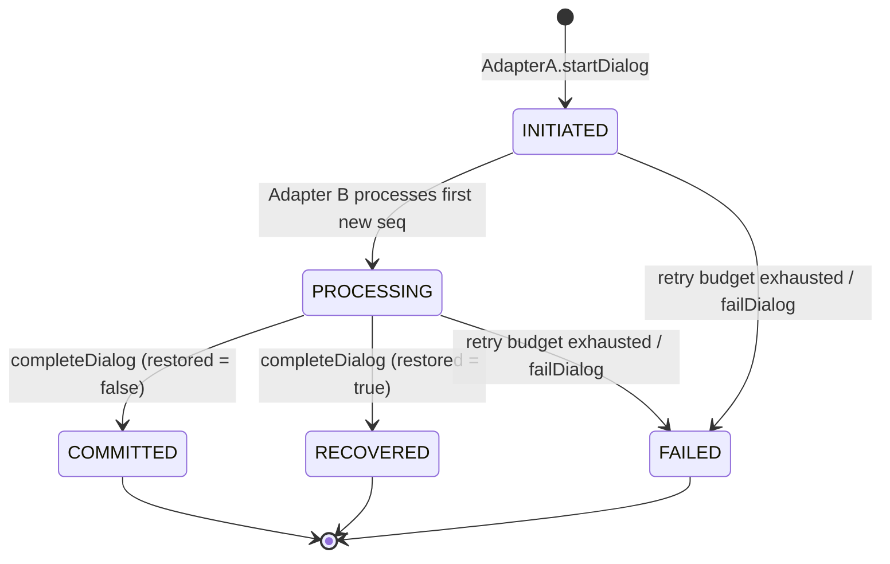

# Experimental Dialog-State Schema — v0.1-experimental

> **Experimental dialog-state schema v0.1-experimental — inspired by emerging IETF agentproto discussions; NOT a standard; NOT MCP; NOT A2A.**
>
> This is the clearly labelled experimental schema required by PS-021 requirement R7. No mentor-selected IETF draft has been pinned. Nothing here claims conformance to any IETF document, the Model Context Protocol, or Agent2Agent. "v0.1-experimental" is a label for this document only; the version is not stored in the database or carried in messages.

**Source of truth.** Every field, type and value below is taken from the backend code:

| Topic | File |
|---|---|
| Lifecycle states, transition table, record types | `backend/src/types/index.ts` |
| Tables and constraints | `backend/src/db/schema.sql` |
| Wire messages | `backend/src/adapters/types.ts` |
| Who triggers transitions | `backend/src/adapters/AdapterA.ts`, `backend/src/adapters/AdapterB.ts`, `backend/src/services/DialogManager.ts` |
| Behaviour evidence | `backend/tests/*.test.ts` |

If this document and the code disagree, the code wins and this document is wrong.

---

## 1. Purpose

The schema lets two mock agent adapters (Adapter A and Adapter B) agree on:

- **which dialog and task** a request belongs to (correlation),
- **which logical request** it is, so a retry is recognised (deduplication),
- **where the dialog is in its lifecycle** (explicit states, valid transitions),
- **what must be written down** so dialog identity, task identity and dedup records survive a restart (durable recovery).

It is a small coordination record. It is not a conversation log, not model memory, and not a message-envelope standard.

---

## 2. Identifiers

| Identifier | Type | Meaning | Generated by | Scope | A retry must preserve it? |
|---|---|---|---|---|---|
| `dialog_id` | string (non-empty) | One bounded A↔B exchange about one task. The **correlation key**. | Adapter A in `startDialog()`: `dlg-<Date.now()>-<7 random base-36 chars>` | Globally unique (primary key of `dialogs`) | **Yes** |
| `task_id` | string (non-empty) | The unit of work the dialog carries. Must survive restarts (R3). | The caller of `AdapterA.startDialog(taskId)` (not derived from `dialog_id`) | Stored once per dialog; Adapter B rejects a request whose `task_id` differs | **Yes** |
| `seq` | integer > 0 | One **logical request** within the dialog. | Adapter A: `MAX(seq)` in its send log for the dialog + 1, so 1, 2, 3, … | Per dialog — `D1`/seq 1 and `D2`/seq 1 are different requests | **Yes** |

**Deduplication key:** `(dialog_id, seq)`. There is no separate `request_id` in the implementation; `seq` within `dialog_id` *is* the request identity.

**Retry rule.** A retry (`AdapterA.retryRequest(dialog_id, seq)`) re-sends the same `dialog_id`, `task_id`, `seq` **and the same payload**. The payload is read back from Adapter A's durable send log, so the caller cannot change it under an existing `(dialog_id, seq)`. Only the `attempts` counter in that log changes. Attempt numbers are not sent on the wire.

---

## 3. Records (durable)

All three tables live in one SQLite file. Both adapters share it (see §10). `PRAGMA foreign_keys = ON`.

### 3.1 Dialog record — table `dialogs`

TypeScript: `DialogRecord` in `types/index.ts`.

| Column | SQL type | TS type | Constraint | Meaning |
|---|---|---|---|---|
| `dialog_id` | TEXT | `string` | PRIMARY KEY, NOT NULL | Correlation key |
| `task_id` | TEXT | `string` | NOT NULL | Task identity |
| `state` | TEXT | `LifecycleState` | NOT NULL, DEFAULT `'INITIATED'`, CHECK in the 5 states | Current lifecycle state (§5) |
| `restored` | INTEGER | `boolean` | NOT NULL, DEFAULT 0, CHECK `IN (0, 1)` | `true` once `AdapterA.recover()` has reloaded this dialog after a restart |

Index: `idx_dialogs_active ON dialogs(state) WHERE state IN ('INITIATED','PROCESSING')`, used to find dialogs to recover.

```json
{
  "dialog_id": "dlg-1791460800000-k3f9q2a",
  "task_id": "task-scenario5",
  "state": "PROCESSING",
  "restored": true
}
```

### 3.2 Processed-request record — table `requests` (Adapter B's ledger)

TypeScript: `RequestRecord`. This is the **deduplication source of truth**.

| Column | SQL type | TS type | Constraint | Meaning |
|---|---|---|---|---|
| `dialog_id` | TEXT | `string` | NOT NULL, REFERENCES `dialogs(dialog_id)` | Dialog |
| `seq` | INTEGER | `number` | NOT NULL, CHECK `seq > 0` | Logical request |
| `processed_at` | TEXT | `string` | NOT NULL | ISO 8601 time Adapter B recorded it |
| `result` | TEXT | `string` | NOT NULL | JSON-serialised result, returned verbatim on a duplicate |

Primary key `(dialog_id, seq)`. A second insert for the same key is rejected.

```json
{
  "dialog_id": "dlg-1791460800000-k3f9q2a",
  "seq": 3,
  "processed_at": "2026-10-08T07:30:00.000Z",
  "result": "{\"processed\":true,\"payload\":{\"step\":3},\"timestamp\":\"2026-10-08T07:30:00.000Z\"}"
}
```

The mock side effect's result shape is `{ processed: true, payload, timestamp }` (`AdapterB.executeMockSideEffect`).

### 3.3 Outbound send-log record — table `outbound_requests` (Adapter A's log)

TypeScript: `OutboundRequestRecord`; statuses `OUTBOUND_STATUSES = ['PENDING', 'ACKED']`.

| Column | SQL type | TS type | Constraint | Meaning |
|---|---|---|---|---|
| `dialog_id` | TEXT | `string` | NOT NULL, REFERENCES `dialogs(dialog_id)` | Dialog |
| `seq` | INTEGER | `number` | NOT NULL, CHECK `seq > 0` | Logical request |
| `payload` | TEXT | `string` | NOT NULL | JSON-serialised payload, replayed on retry |
| `status` | TEXT | `'PENDING' \| 'ACKED'` | NOT NULL, DEFAULT `'PENDING'`, CHECK | `PENDING` = no `ok`/`duplicate` answer yet |
| `attempts` | INTEGER | `number` | NOT NULL, DEFAULT 1, CHECK `>= 1` | Times this request was handed to the transport |

Primary key `(dialog_id, seq)`. The row is written **before** the transport call. It flips to `ACKED` when Adapter B answers `ok` or `duplicate`. An `error` answer or a dropped message leaves it `PENDING`.

```json
{
  "dialog_id": "dlg-1791460800000-k3f9q2a",
  "seq": 3,
  "payload": "{\"step\":3}",
  "status": "PENDING",
  "attempts": 1
}
```

---

## 4. Messages (in-process, not persisted)

TypeScript: `AdapterRequest` / `AdapterResponse` in `adapters/types.ts`. They are passed as objects through the in-process `Transport`; there is no wire encoding.

### 4.1 Request (Adapter A → Adapter B)

| Field | Type | Meaning |
|---|---|---|
| `dialog_id` | `string` | Correlation key |
| `task_id` | `string` | Task identity (checked against the stored value) |
| `seq` | `number` | Logical request; with `dialog_id` forms the dedup key |
| `payload` | `unknown` | Mock business payload |

```json
{ "dialog_id": "dlg-1791460800000-k3f9q2a", "task_id": "task-scenario5", "seq": 3, "payload": { "step": 3 } }
```

### 4.2 Response (Adapter B → Adapter A)

| Field | Type | Meaning |
|---|---|---|
| `dialog_id`, `task_id`, `seq` | as request | Echoed so the response correlates to its request |
| `status` | `'ok' \| 'duplicate' \| 'error'` | `ok`: processed now. `duplicate`: `(dialog_id, seq)` was already processed; stored result returned, side effect not run again. `error`: rejected. |
| `result` | `unknown` | `ok`: the new result. `duplicate`: the stored result (parsed from `requests.result`). `error`: `null`. |
| `error` | `string` (optional) | Human-readable reason; present on `error` |
| `error_code` | `AdapterErrorCode` (optional) | Present on every `error`; absent on `ok`/`duplicate` |

`AdapterErrorCode` values:

| Code | When | Raised from |
|---|---|---|
| `DIALOG_NOT_FOUND` | No dialog with this `dialog_id` | `NotFoundError` in `DialogManager.requireDialog` |
| `TASK_MISMATCH` | Dialog exists, `task_id` differs from the stored one | `TaskMismatchError` in `DialogManager.correlate` |
| `DIALOG_TERMINAL` | Dialog is `COMMITTED` / `RECOVERED` / `FAILED` and this `(dialog_id, seq)` was never processed | `DialogTerminalError` in `AdapterB.handleRequest` |
| `INTERNAL` | Any other failure | — |

```json
{ "dialog_id": "dlg-1791460800000-k3f9q2a", "task_id": "task-scenario5", "seq": 3,
  "status": "duplicate",
  "result": { "processed": true, "payload": { "step": 3 }, "timestamp": "2026-10-08T07:30:00.000Z" } }
```

```json
{ "dialog_id": "dlg-1791460800000-k3f9q2a", "task_id": "task-scenario5", "seq": 99,
  "status": "error", "result": null,
  "error": "Dialog dlg-1791460800000-k3f9q2a is in terminal state RECOVERED and cannot accept new requests",
  "error_code": "DIALOG_TERMINAL" }
```

---

## 5. Lifecycle

Exactly five states (`LIFECYCLE_STATES`). There is no `WAITING_ACK`; the old frontend simulation that had one was removed in Phase 8, and the dashboard shows these five states.

| From | To | Triggered by | Condition |
|---|---|---|---|
| — | `INITIATED` | `AdapterA.startDialog(taskId)` | New dialog, `restored = false` |
| `INITIATED` | `PROCESSING` | Adapter B (`handleRequest`) | First new `(dialog_id, seq)` processed and recorded |
| `INITIATED` | `FAILED` | Adapter A | Retry budget exhausted (below), or `AdapterA.failDialog(id, reason)` |
| `PROCESSING` | `COMMITTED` | `AdapterA.completeDialog(id)` | `restored = false` and no `PENDING` row for the dialog |
| `PROCESSING` | `RECOVERED` | `AdapterA.completeDialog(id)` | `restored = true` (set by `recover()`) and no `PENDING` row |
| `PROCESSING` | `FAILED` | Adapter A | Retry budget exhausted, or `failDialog` |
| `COMMITTED` / `RECOVERED` / `FAILED` | — | — | Terminal: every transition is rejected (`InvalidTransitionError`) |

**Retry budget.** `AdapterA` takes `{ maxAttempts }` (default `DEFAULT_MAX_ATTEMPTS = 5`). When the transport drops a message (`MessageDroppedError`) for a `(dialog_id, seq)` whose send-log row is still `PENDING` and has `attempts >= maxAttempts`, Adapter A moves the dialog to `FAILED` and rethrows the error. An `ACKED` row never counts, so dedup replays cannot fail a dialog.

`completeDialog` throws `ConflictError` while any request is `PENDING`, and `InvalidTransitionError` unless the dialog is `PROCESSING`. The `failDialog` reason is logged only, not persisted.



---

## 6. Correlation rule

`DialogManager.correlate(dialog_id, task_id)`, called by Adapter B for every request:

1. Look up the dialog by `dialog_id`. Not found → `DIALOG_NOT_FOUND`. Adapter B never creates dialogs.
2. Compare `task_id` with the stored value. Different → `TASK_MISMATCH`.
3. Otherwise the request belongs to that dialog/task.

Correlation uses `dialog_id`, never `seq` alone or `task_id` alone. Two dialogs may carry the same `task_id`.

---

## 7. Deduplication rule

Adapter B, after correlation succeeds (`AdapterB.handleRequest`, in this order):

1. If `requests` already has `(dialog_id, seq)` → respond `duplicate` with the stored `result`. The side effect is **not** run again. This applies **even when the dialog is terminal** (idempotent replay).
2. Else, if the dialog is terminal → respond `error` / `DIALOG_TERMINAL`. No side effect, no record, no transition.
3. Else run the mock side effect, insert the `requests` row (written to disk immediately), move `INITIATED → PROCESSING` if needed, respond `ok`.

Adapter A's side: `sendRequest` on a terminal dialog throws `DialogTerminalError` **before** assigning a `seq` or writing a `PENDING` row. `retryRequest` on a terminal dialog is allowed only for a `seq` already in the send log (`NotFoundError` otherwise) and never changes the dialog state.

**Guarantee, stated precisely:** duplicate-side-effect prevention when the original request has already been durably recorded as processed. This is **not** exactly-once delivery (§9).

---

## 8. Recovery rule

A "restart" means discarding every in-memory object (adapters, transport, side-effect counter, database handle) and reopening the same SQLite file. Durable rows are all that remain.

- **Adapter B** needs no recovery step. Its correlation and dedup read the `dialogs` and `requests` tables directly.
- **Adapter A** calls `recover()`. For every dialog in `INITIATED` or `PROCESSING`:
  - set `restored = true` (state unchanged),
  - start driving it again in this instance,
  - report `nextSeq = MAX(seq in outbound_requests) + 1` (or 1 if none) — never supplied by the caller,
  - report `pendingSeqs` = `PENDING` rows in `seq` order, to be retried with their stored payload.

  Terminal dialogs are not resumed. A restarted Adapter A cannot send on a dialog until `recover()` has run.

`recover()` returns `RecoveredDialog[]`:

```json
[{ "dialog_id": "dlg-1791460800000-k3f9q2a", "task_id": "task-scenario5",
   "state": "PROCESSING", "nextSeq": 4, "pendingSeqs": [3] }]
```

A dialog completed after recovery ends `RECOVERED`; one completed without a restart ends `COMMITTED`.

---

## 9. Limitations and non-claims

- **Crash window (not closed).** Adapter B runs the side effect, *then* persists the `requests` row. A crash between the two loses the record, and a retry runs the side effect again. Hence: **no exactly-once claim.**
- **Single shared store, single process.** Both adapters use one sql.js handle over one SQLite file. This is not a model of independent stores or a distributed protocol.
- **Durability mechanics.** sql.js holds the database in memory; after every mutation the whole database is exported and written over the file (`fs.writeFileSync`, not an atomic rename). A crash during that write could corrupt the file.
- **In-process transport** with "drop next request / drop next response" fault injection only. No real network, timeouts, reordering or concurrency.
- **Retry-budget accounting.** `attempts` also counts attempts that received an `error` reply, so a `PENDING` row may reach `maxAttempts` with fewer than `maxAttempts` dropped messages.
- **Side-effect counter** (`InMemorySideEffectTracker`) is in memory and resets on restart. Tests use it to show the side effect did not run again.
- Not an IETF standard, not MCP, not A2A, no interoperability claim. No authentication, authorisation or integrity protection.

---

## 10. Deliberately excluded

| Not in the schema | Why |
|---|---|
| `request_id` | `(dialog_id, seq)` is the request identity |
| `schema_version` field | The version is a document label; nothing negotiates it |
| `initiator` / `responder` | Roles are fixed by the code (A sends, B receives) |
| Timestamps on `dialogs` | Not needed for correlation, dedup or recovery |
| Transition history | Not persisted. `TransitionEntry` exists as a type but is unused. |
| Failure reason | Logged by `failDialog` / budget exhaustion, not stored |
| Attempt number on the wire | Only Adapter A's log keeps `attempts` |
| Conversation history, prompts, model memory | A dialog record is coordination state, not a transcript |
